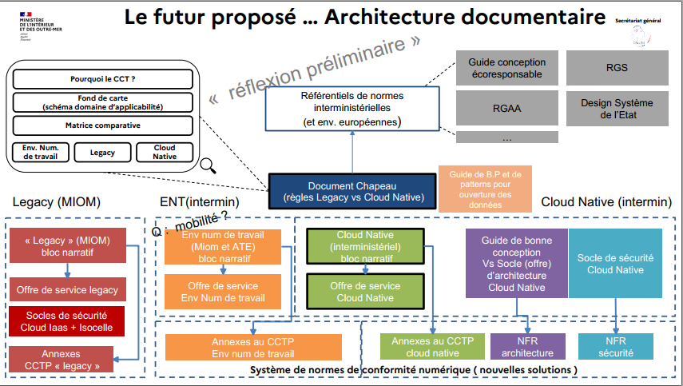

 

```
Cadre de Cohérence Technique (CCT)

Volet  : Cloud π Native  à portée interministérielle

Version : alpha.V2
Date : 15/01/2023
Auteur : Ministère de l’Intérieur
```

## TABLE DES MATIÈRES

<br>1 -  Guide d’utilisation rapide ( cf read-me)
<br>2 - Le contexte, les enjeux, la vision
<br>3 - Principes généraux cadre Cloud Native
<br>. Les configurations d’hébergement prises en compte
<br>. Gestion des non-conformités, dérogations et contribution
<br>. Le modèle organisationnel, de responsabilité et de collaboration Cloud Native
<br>. Préconisations générales d’architecture et technique
<br>. Des spécificités à prendre en compte sur la création des conteneurs
<br>. Des spécificités à prendre en compte sur la topologie réseau et les ouvertures de flux
<br>. Modèle d’intégration d’une application dans le cadre Cloud Native
<br>4 - Présentation de l’offre interMinistérielle Cloud Pi Native
<br>5 - Référentiel d’exigences et modalités d'usage
<br>5 -  Annexes
<br>. Les normes industrielles, institutionnelles applicables
<br>. Liens vers autres contenus utiles(informatif)
<br>. Glossaire

## 2 - Le contexte, les enjeux, la vision

Audience : ce paragraphe s’adresse à tout acteur considérant l’usage de l’offre Cloud Pi Native du ministère de l’intérieur, il présente les principes fondateurs.

**Le cloud : des nouvelles possibilités techniques, une collaboration étendue des acteurs pour répondre aux enjeux d’un contexte exigeant, incertain et accéléré.**

À travers sa doctrine « Cloud au centre », l’État encourage l’ensemble des acteurs publics à se saisir de son potentiel afin de développer une nouvelle génération de services numériques de qualité et qui répond au besoin dans un cadre de normes juridiques adapté à l’usage. Cela répond notamment au besoin accru d’agilité et d’efficience de l’administration.

Le Cloud est une approche d’accès à l’infrastructure d’hébergement à travers une interface standardisée et abstraite des technologies sous-jacentes. Cette abstraction permet une automatisation poussée, supprimer les frictions organisationnelles, les non-qualités et lenteurs induites par des opérations manuelles. L’infrastructure est pilotable par du logiciel et donc automatisable avec des processus reproductibles.


La technologie Cloud Native fait référence à l’usage de Kubernetes. Kubernetes est une technologie issue des travaux des grands acteurs de l’Internet il y a plus de 15 ans pour rendre encore plus efficace et sécurisée l’usage des infrastructures techniques, la résilience des hébergements et apporter une souplesse organisationnelle accrue.

Les grands services de l’internet s'appuient sur cette technologie pour gérer une demande  extrême. L’ensemble des organisations ayant mis en œuvre cette technologie telle que EDF, Orange, des services de vente en ligne, des Banques, Airbus, Urssaf, etc… ont vu également leurs efficiences de l’usage du numérique augmenter, il y a un _avant et un après_.

Le ministère de l’intérieur, l’un des premiers acteurs étatiques à avoir proposé une offre Cloud il y a plus de 5 ans, étend son offre de service, en proposant l’offre Cloud Pi Native combinant une offre d'hébergement kubernetes sécurisée jusqu’au niveau DR. Cette offre est accompagnée d’un modèle DevSecOps outillé permettant une fluidité organisationnelle accrue et un renforcement de la qualité des solutions numériques.

Pour tirer parti au maximum du cloud, les architectures ont évolué ainsi que les modèles de responsabilité et organisationnel. L’une des problématiques majeures des pratiques du passé était la segmentation des responsabilités entre la construction, la vérification, le déploiement et l’hébergement. Les approches cloud, devops et l’agilité ont progressivement permis de concilier des postures antagonistes : les développeurs ayant besoin de pouvoir déployer fréquemment, et l’exploitation ayant au contraire besoin de stabilité et de diminuer les risques liés au changement. La clé réside dans une collaboration étendue de tous les acteurs en prenant compte de la sécurité à toutes les étapes.

**Une évolution des pratiques pour un numérique efficient et éco-responsable et réactif**

Les contraintes s’accentuent sur la production de services numériques, le standard de qualité général a augmenté massivement avec les acteurs du net et industrielle qui produisent des solutions ergonomiques, sécurisées qui montent à l’échelle facilement. Un fossé important s’est creusé entre l’efficience du numérique ‘legacy’ et ce monde moderne.

L’environnement change rapidement, il devient incertain, il faut réagir de plus en plus rapidement, la pression augmente sur la production de solutions numériques ergonomique, nécessitant des cycles raccourcis, la prise en compte de l’éco responsabilité, de l’accessibilité et le maintien d’un haut standard de qualité et de sécurisation.

Seul un changement majeur de pratiques s’appuyant sur l’opportunité du Cloud Native ( kubernetes ) et du DevSecOps permettent de satisfaire ce nouveau standard d’exigences.

**<span style="text-decoration:underline;">Les principales caractéristiques du modèle opérationnel Cloud Native:</span>**

** **

Un mode de collaboration étendu, la suppression de la fragmentation des responsabilités et l’automatisation :

* Le développeur (l’équipe) voit ses prérogatives étendues, il est responsabilisé sur la qualité de la solution produite jusqu'à la production, c’est le modèle « You build it you run it ». ( vous l’avez construit vous l’opérez )
* L’hébergeur assure quant à lui, la mise à disposition d’une offre de service hautement disponible et sécurisée. L’usage de l’offre est réalisé via une console, une interface technique normée (API), une documentation et des exemples fonctionnels permettant un démarrage accéléré.

Les clients sont autonomes, l’hébergeur n’échange pas avec la direction d’application. Il n’y a pas de nécessité de réaliser d’opérations manuelles.

L’ensemble des opérations réalisées manuellement auparavant lors des étapes d’élaboration sont complètement automatisées. Le code logiciel est testé en permanence et automatiquement par un outillage : l’orchestrateur DevSecOps.

Pour assurer la qualité du code, plusieurs principes sont mis en œuvre automatiquement :

* une couverture de test (100% sur le back-end)
* l’analyse statique du code
* l’analyse récursive de vulnérabilité des composants importés (librairie, images )
* des tests de sécurité et de performances.

Le développeur est prévenu au plus tôt par l’orchestrateur DevSecOps en cas de non-qualité. Seul un logiciel ayant atteint le niveau de qualité fixé peut être déployé.

Soutenus par l’outillage, les développeurs assurent continuellement la qualité et la sécurité du code produit, la non-régression et l'absence de vulnérabilité.

Les architectures sont modulaires et les composants internes ainsi que les interfaces entre applications sont découplées, c’est à dire rendus indépendants techniquement et organisationnellement via des interfaces normées (APi). Cela permet la maintenance et les  évolutions indépendantes entre composants. Ce découplage contribue fortement à réduire le coût des changements et faciliter les transitions technologiques en cas d’obsolescence.

La conception de l’architecture, le choix des langages sont faits pour une efficience de l’usage des ressources d’infrastructures et également sur l’impact sur le poste de travail.

La conteneurisation, l'élasticité dynamique de la solution d'orchestration de conteneurs kubernetes, la mutualisation des infrastructures physiques soutiennent fortement cette  efficience.

Le non-respect de ce principe de modularité a été identifié par la direction interministérielle du numérique comme l’une des causes d’échec des grands programmes de l’État.

La modularité, l’indépendance des modules lors du déploiement, permettent de réduire la taille des déploiements ce qui contribue à réduire les risques et fluidifier les mises en production. Les déploiements peuvent ainsi être rendus transparents pour  des usagers et les retours arrière éventuels sont  facilités. Il est ainsi possible de déployer en confiance, plusieurs évolutions par jour si nécessaire.

L’automatisation permet de  mieux contrôler et rendre les actions prédictibles, faciliter la reprise en cas d’incident et minimiser les coûts de maintien en conditions opérationnelles et de sécurité des applications. Plus aucune intervention manuelle n’est effectuée sur les environnements ce qui permet de réduire la variance, les non-qualités, et aussi de (re)construire très rapidement des plateformes.

In fine, la conception doit s’inscrire dans une démarche d’éco-conception et de sobriété numérique des conceptions (green IT)  permettant un usage plus efficient des ressources  qu’elles soient RH, financières. L’État devant être exemplaire. cf guide d’éco-conception.


###


## 3 - Principes généraux cadre Cloud Native

Audience : ce paragraphe s’adresse à la communauté des concepteurs et architectes solutions, le lecteur est réputé compétent et formé sur les sujets abordés .

Le cadre de cohérence technique régule et normalise les différents domaines associés à l’élaboration et au maintien des ressources partagées nécessaires à la mise à disposition de solutions numériques de qualité répondant au besoin. Il s’assure que l’ensemble peut-être mis en œuvre de manière cohérente avec une consommation minimisée des ressources : financière, RH et écologique. Il recommande ou fixe les mesures permettant d’atteindre l’objectif, tout en favorisant l’innovation, la prise en compte de l’obsolescence régulière des technologies et la manœuvre RH nécessaire (formation continue, recrutement …)



Figure 1 - Architecture des différents volets du CCT.

Le volet Cloud Native du ministère de l’intérieur, hérite de normes industrielles, interMinistérielles, européennes. La portée est interMinistérielle, ce document a fait l’objet d’échanges avec la direction interMinistérielle du numérique et des ministères primo-accédants.

Pour le ministère de l'intérieur, il encadre la conception et l’hébergement d’applications qu’elles soient hébergées dans les datacenters du ministère ou bien à l’externe sur des clouds public. Ce volet s’applique notamment lors de la conception d’une nouvelle application ou une évolution significative d’une application existante. (cf Doctrine Cloud au centre)

Pour les autres entités étatiques, ce volet sert de présentation de bonnes pratiques et présente les conditions générales d’utilisation de l’offre Cloud Pi Native.

Ce document ainsi que le référentiel d’exigences sont annexés aux dossiers de consultation des entreprises. La portée administrative étant précisée par le règlement de consultation (RC) du marché lui-même, typiquement le RC et le Cadre des clauses administratives particulières (CCAP) peuvent exclure administrativement un candidat en cas de non-respect des exigences P primordiale. (hors dérogation soumise, instruite et accordée).

D’autres référentiels d’exigences ou des guides peuvent être applicables ou conseillés. voir plus loin le chapitre sur les cadres de normes supérieures.

**Offre de service Cloud (π) Native :**

Concerne la description de l’offre de service managé d’infrastructure Cloud **π** et d’une chaîne DevSecOps assurant l’homologation en continu et le déploiement en production. Cf. présentation de l’offre plus loin dans ce document.

**Poste de travail agent : **

Dans le cadre d’une application rendue accessible sur le poste de travail de l’agent, le lecteur est invité à se conformer également au volet _Environnement Numérique de Travail_, notamment sur les aspects d’intégration au SSO et la politique des navigateurs.

**Ouverture des données : **

Sur la thématique de l’ouverture et de la circulation de la donnée, le projet est invité à se mettre en conformité avec le volet idoine. Cela concerne notamment le référencement des objets métiers dans le référentiel de cartographie des données et la mise à disposition d’une facilité technique d’accès à la donnée basée sur un standard d’échange de type API.

L’ensemble des acteurs de l’État est invité à faire circuler la donnée au profit d’une simplification du fonctionnement des administrations et d’un service public ergonomique et proactif .  (cf rapport Bothorel, lois CRPA et 3DS, … )


### Les configurations d’hébergement prises en compte

Le ministère de l’intérieur dispose de plusieurs capacité d’hébergement d’application. Ces offres peuvent être historiques et liées à une entité  (ex: Sgami, ANTS)  ou centrales.

Les offres centrales sont découpées en plusieurs catégories  :

* **Physique ou virtualisées** généralement de type VMWAre tel qu’Isocèle ( DNUM), STIG (STSI2). Cette offre est accessible qu’au MIOM et seul l’exploitant gère la plateforme et les actes d’intervention techniques via Ticketing ITMS
* **Offre Cloud Pi**[^1]** ‘legacy”** : offre Iaas basée sur OpenSack, actuellement en bascule vers Gen2. La gestion interne des ‘tenants’ est à la main du développeur, le reste via ticketing. Le développeur gère son outillage en autonomie


* **Offre Cloud Pi Native** ( objet de ce volet de CCT ) :  nouvelle offre associant une homologation continue, un socle d’homologation et un hébergement étatique sur kubernetes avec une ouverture ‘accéléré’ des flux réseau.

Les configurations suivantes sont prises en compte par ce volet Cloud (Pi) Native du CCT.
* Hébergement sur les clusters kubernetes managés par le ministère de l’Intérieur, jusqu’au niveau « donnée restreinte » ;
* Hébergement sur un cluster kubernetes externe au ministère, compatible avec la sensibilité des données manipulées ;
* Hébergement sur un cluster kubernetes dédié et géré par l’application;
* Une approche hybride multi-clusters.

Pour l’ensemble de ces configurations l’usage de la chaîne DevSecOps managée par le Ministère de l’Intérieur est impératif. (hors cadre dérogatoire accordée)

### Gestion des non-conformités, dérogations et contribution

L’évolution rapide des technologies cloud peut conduire à ce que le cadre CCT restreigne l’innovation. Il est également souhaité, pour éprouver le modèle, de notifier le département architecture d'entreprise du Ministère de l'intérieur au plus tôt des éventuelles impossibilités ou limitations remarquées. Les directions d’applications ou les organisations utilisatrices peuvent contribuer, via un échange préalable, à enrichir les fonctionnalités de l’offre ou du cadre lui-même. Sur l’offre la contribution est effectuée directement sur le repository open source de la solution via un pull request.

En cas de non-conformité au CCT ou absence de contribution à l’offre, une demande de dérogation dûment motivée sera formulée à l’avance par la direction d’application. Seule la notification de la décision permet d’amender le besoin de conformité au cadre, temporairement ou de manière pérenne dans le cadre d’une dérogation. Dans le cadre d’une dérogation, la direction d’application prend à sa charge le surcoût complet de possession. ( formation, homologation, personnel assurant la tme, etc… )

Lors de l’utilisation du cadre et de l’offre Cloud PI Native, toute organisation souhaitant décliner ce cadre dans un document de norme inférieur pour un besoin propre est invitée à référencer la dernière version de ce document en l’état.  Dans la hiérarchie des normes, une instruction de niveau inférieur ne peut entrer en conflit ou contredire ce présent document.


### Le modèle organisationnel, de responsabilité et de collaboration Cloud Native

L’architecture, le modèle de responsabilité et d’organisation à mettre en place est orienté pour maximiser la qualité, la sécurité, la fluidité opérationnelle et l’évolutivité du produit en  tirant parti au maximum des possibilités offertes par la technologie kubernetes, un flux de production DevSecOps et une collaboration étendue entre les acteurs.

**L’élargissement de la responsabilité du développeur**

La responsabilité du développeur est élargie dans le cadre Cloud Native. Il élabore et exploite une solution qui répond au besoin métier généralement une automatisation d’un ou plusieurs processus métiers . Le développeur s'assure de la qualité et de la disponibilité du service rendu à l’usager selon le précepte : « You build it, you run it ». Il s’organise en équipe intégrée, si nécessaire avec de l’externalisation.

Le développeur met à disposition d’un point de vérité du code sous la forme d’un ou plusieurs dépôts de code logiciel fonctionnel et d’infrastructure. Il met en place un flux intégré et continu de production en s'appuyant sur un orchestrateur primaire DevSecOps qu’il construit et opère.

Le développeur initialise et supervise le pipeline de l’orchestrateur secondaire opéré par le ministère de l’Intérieur (cf plus loin sur la configuration de l’offre Cloud Pi Native). Il intègre les étapes de vérification de sécurité génériques imposées par le minist!re et spécifiques issus de la démarche d’homologation.

L’ensemble combiné des orchestrateurs primaire et secondaire assure la fonction d’homologation et de déploiement en continu du produit numérique.

Dans le cas de la détection d’une non-qualité, la progression du déploiement est stoppée par la/les chaînes, le développeur est prévenu en temps réel et doit corriger au plus tôt les défauts remontés. Cette approche permet de garantir un niveau de qualité, évite des régressions et maintient la dette technique au niveau le plus bas.

Sur le plan organisationnel le développeur met généralement en place :


* l’agilité** **avec des itérations courtes de constructions et de vérification des usagers ;
* le découpage des livraisons en lot de taille de réduite ;
* la mise en place d’une culture de collaboration étendue et des pratiques intégrant la sécurité à toutes les étapes.

**<span style="text-decoration:underline;">La répartition des responsabilités s'établit de la manière suivante :</span>**

**Le Concepteur / Développeur :**


* est responsable de l’application, de la qualité du code  et du bon fonctionnement de l’application pendant <span style="text-decoration:underline;">l’ensemble du cycle de vie de l’application. </span>
* est responsable de définir et d’ajuster l’infrastructure et l’élasticité du dimensionnement, nécessaire à son application (sur la base de l’offre Cloud adaptée selon la sensibilité des données) Il s'appuie sur les patterns applicatives validées, les pratiques cloud native sécurisées, l’offre de service des _operators _et charts helm disponibles.
* fourni un code de qualité exempt de défaut d'algorithmes, de qualité et de vulnérabilité.
* met en œuvre le flux de production, logiciel local permettant d’assurer la production et la démonstration d’un code de qualité exempt d’anomalie fonctionnelle, de non-qualité et de vulnérabilité, notamment dans les librairies importées.
* Il pose les normes de développement des langages utilisés.
* Il met en place un orchestrateur et des pratiques DevSecOps visant un maintien de la qualité dans le temps avec les composantes suivantes :
    * test driven development
    * une couverture de test unitaire à 100% du back-end
    * une couverture significative des tests du front de l’application
    * analyse statique de qualité du code
    * analyse récursive des vulnérabilités des librairies importées
    * utilisation exclusivement d’images sources maintenues en condition de sécurité et certifiées (distribution LTS) ;
    * la conception des tests d’intégration en sandbox.
    * la fourniture des outils nécessaires à la remontée de l'état de santé des briques applicatives destinées à fonctionner en production (healthcheck).
    * la fourniture des indicateurs nécessaires au suivi en temps réel de la qualité en condition opérationnelle de sa solution (exports prometheus).
    * l'exploitation des logs remontés
* Il met en place un hébergement sur une plateforme kubernetes afin d’assurer la démonstration du bon fonctionnement de l’application avec la solution qu’il préfère soit internalisée (avec un moyen de mener des démonstrations) ou sur cloud public.
* Il met en œuvre l’intégration technique et organisationnelle avec la chaîne DevSecOps de l’offre Cloud Pi Native et initialise le flux logiciel  global (cf plus bas).
* Il maintient un point de vérité du code logiciel ainsi que celui du code d’infrastructure. Celui-ci est accédé par la chaîne DevSecOps étatique, la sécurisation d’accès issus par token.
* Il est responsable de la surveillance de l’ensemble des pipelines, y compris pour celui géré côté ministère.
* Il met en place une intégration du flux de retour d’anomalie “shift-left” des orchestrateurs afin de permettre une correction au plus tôt des anomalies.
* Il effectue l’apprentissage comportemental du firewall applicatif Web (WAF) vis-à-vis de l’application dans le cadre fixé par le ministère.
* Il est invité à mettre en œuvre ce pipeline au plus tôt dans le processus de réalisation.

**L’exploitant ministériel de l’orchestrateur DevSevOps** :

Il assure la gouvernance et la cohérence structurelle de l'ensemble des régions de cloud PI. Il associe à ce titre dans ses décisions des représentants de l'ensemble des opérateurs cloud.

* Il s'assure de la disponibilité et de la qualité de fonctionnement de la chaîne DevSecOps et maintient à jour la documentation sur le fonctionnement des interfaces et assure les évolutions fonctionnelles;
* Il assure les retours d'anomalies "shift-left" lors des opérations de déploiement continu. L'intégration et leurs traitements sont à la charge du Concepteur / développeur;
* Il contribue à la mise en place et l’évolution du catalogue d’operator Kubernetes, de charts helm et du référentiel de pattern de référence;
* Il est également en lien avec les autorités d’homologation afin de s’assurer que l’ensemble est en condition d’assurer la protection d’ensemble;
* Il intègre les propositions d'évolution “pull request” proposée en fonction de son plan de charge et d’une négociation préalable;
* Il oriente le concepteur / développeur vers l'opérateur cloud qui hébergera son produit;
* Il sera en charge de migrer les applications hébergées vers un autre opérateur si nécessaire;
* Il fournit la documentation dont les éléments d’orientation ou d’aide à la migration permettant au développeur de s’orienter vers l'opérateur cloud qui hébergera son produit; ( cela dépend également des décisions projets ou d’homologation )

**L’opérateur Cloud** :

ll assure le maintien en condition de disponibilité et de sécurité de l’offre d’hébergement, l’interface API de management, la console,  la gestion capacité et les offres de services managées.
Le Cloud PI est constitué de plusieurs régions ( elle même constituées de plusieurs centres de calculs ), zones de sensibilité usuel et DR.
Chacune des régions peuvent faire l’objet d’une affinité ou restriction de service sur la nature des données, des typologies de projets, ministériels et interministériel. Ces affinités ou restrictions sont également applicables à la chaîne De SecOps secondaire.
La gouvernance du produit ‘Cloud Pi Native” à portée interministérielle et ministérielle définit la politique d’ensemble, elle traite d’aspects tel que :
- restriction ou affinité d’accès aux régions, projets, chaine secondaire;
- politique de données définie dans l'extension de la définition de "données restreintes" ;
- la capacité en matière de ressources nécessaires à héberger de nouveaux projets ;
- la localisation géographique et le nombre de centres de calculs constituant sa région ;
- les services mis à disposition ;
- les possibilités d'interconnexion réseau avec d'autres systèmes;

La version courante de l’offre et la politique d’usage est mise à disposition sur portail et notamment vers l’utilisateur lors de la connexion à la console. La version courante est présentée dans les grandes lignes au paragraphe 4.

Des pratiques complémentaires sont introduites dans la configuration Cloud Native :

**Le GitOps**, contraction de git et opération, est indispensable à la gestion des applications Cloud Native avec Kubernetes. Ce mode d’organisation du code d'infrastructure permet de maîtriser la description de l’infrastructure de production avec les mêmes pratiques de revue collaborative que celle du logiciel. Il est par exemple strictement interdit de faire des modifications « à la main » sur l’environnement de production, toute variation étant automatiquement supprimée. L’infrastructure réelle est strictement celle décrite par les fichiers d’infrastructure.

Le **shift-left** (vers la gauche, du processus) fait référence à la remontée le plus tôt possible vers le développeur des anomalies identifiées par la chaîne de déploiement et de vérification DevSecOps.

**<span style="text-decoration:underline;">Présentation du cycle d’usage de l’offre pour les directions d’applications:</span>**

**Phase d’initialisation du projet**

* Le développeur initialise l’environnement de développement, il est autonome pour les choix techniques, il respecte les exigences organisationnels et de processus automatisé permettant de maintenir une qualité constante.
* Le développeur décide de l’infrastructure d’hébergement en fonction des contraintes sur les données (ministère de l’intérieur, cloud externe ou dédié).
* Le développeur commande, (signature de convention), initialise l’espace projet au ministère et configure selon son choix d’infrastructure les environnements désirés. Il récupère les clés techniques nécessaires à l’intégration des pipelines.
* Le développeur effectue l’intégration des pipelines, cf  labels (2) , et (4) si l’infrastructure est externe.
* Il vérifie que l’ensemble du pipeline est opérationnel à partir d’un code d’exemple fourni de type “hello word”.

**Principe de fonctionnement du pipeline d’ensemble (chaines primaire et secondaire)**


* **[1]** Le code logiciel ainsi que celui de description des infrastructures sont produits au sein de l’espace du développeur/concepteur, généralement en externe au Ministère de l’Intérieur.
* **[2a]** **[2b]**Une interface bi-directionelle entre l’espace du concepteur / développeur et celui de DSO permet en push-pull à la chaîne secondaire de récupérer automatiquement l’ensemble du code et des dépendances nécessaires.
* Le développeur déclenche par appel API les services de synchro /  build / deploy. ( il n’y accède pas directement sauf via un Bastion)
* **[3a][3b]** La chaîne d’orchestration DevSecOps effectue la récupération du code, des tests de qualité du code, scan de vulnérabilité des dépendances, la reconstruction, les tests de nos régressions, des tests d’homologation, vérification des manifests / charts etc… au regard des politiques de sécurité et dépose les images certifiées sur la registry de la chaîne ainsi que le code d’infrastructure.
* Le concepteur/développeur accède à un retour d’information détaillée sur le succès ou sur les éventuels défauts, lors du build, deploy de l’application par DSO. ( via message ou webhook )
* **[4]** : La console provisionne si nécessaires les environnements en ‘poussant’ les ressources nécessaires une foi (secrets, application.yaml (argo), certificats, etc... )
* **[5]** : L’infrastructure vérifie régulièrement les changements sur le dépôt d’infrastructure (ou déclenchement forcé par API) et synchronise l’environnement à la cible visé et opère une bascule blue-green transparente, cf ArgoCD  ( si échec l’environnement de prod reste inchangé )
* **[6]** : Le développeur accède à un proxy d’observation du fonctionnement de l’application
* Note : Les développeurs n'accèdent pas directement à la production. Seuls les administrateurs habilités peuvent y avoir accès via bastion.


###


### Préconisations générales d’architecture et technique

Ce chapitre précise les aspects importants liés à l’usage de kubernetes dans le cadre du ministère de l’intérieur. Il est attendu que les acteurs soient correctement formés à la solution kubernetes et se maintiennent à jour. La technologie évoluant rapidement. 	

Le fondement des normes techniques est issu du cadre “Cloud Native”, largement accepté et appliqué au sein de l'État et du secteur privé, tel que les “15 factors”.

C’est le respect de ces normes qui permet à la fois d’adresser les enjeux de performance en termes de vitesse de livraison et de qualité de service, mais aussi de normaliser les applicatifs pour une meilleure évolutivité et maîtrise de la dette technique. Enfin, elles assurent une intégration fluide au sein des systèmes d’information ministériels.

Un des principes cœurs est de laisser un certain degré de liberté au concepteur/développeur sur le fonctionnement interne de son application. Au contraire, les intéractions avec les autres applications et services seront particulièrement contraintes.

Il est à noter que la plateforme d’orchestration de conteneurs Kubernetes est la seule s'inscrivant dans le présent cadre de cohérence, celle-ci étant considérée comme l’état de l’art, et open-source de surcroît.

À propos de la solution mutualisée d’hébergement Cloud π Native

La solution d’hébergement est basée sur des clusters Kubernetes implémentés et opérés par chaque opérateur cloud de manière à ce que les versions de base ainsi que les configurations techniques et organisationnelles s’appuient sur les recommandations de sécurisation de l’ensemble des acteurs cybers.

Les développeurs n’accèdent pas directement à la plateforme ; cet accès s’effectue via une console dédiée et un flux “gitops” (via l’usage d’ArgoCD).

Pour information : des tests de compatibilité avec d’autres solutions d’hébergement d’acteurs du cloud public ont été menés avec succès.


### Des spécificités à prendre en compte sur la création des conteneurs

Kubernetes impose une rigueur un peu plus élevée à l’initialisation que d’autres solutions.

Les pods (conteneurs) sont **obligatoirement rootless**, c’est à dire que le compte root n’est jamais utilisé pour faire fonctionner le service et ils utilisent uniquement des ports > 1024.

**Note :** Toute implémentation Kubernetes proposée par un opérateur cloud PI doit interdire le lancement de pod utilisant le compte root. Ce point n’est pas modifiable. Ceci est un point d’attention majeur, la quasi-totalité des conteneurs à disposition sur les plateformes de partage de conteneurs n'étant pas rootless.

Les pods doivent démarrer dans leur configuration cible sans état, ou via le passage de paramètres de démarrage ou d’environnement.

Les pods doivent démarrer rapidement afin de permettre au mécanisme d’orchestration de fonctionner sans délai.

Les pods sont responsables de vérifier au lancement, si l’application est dans la condition initiale de premier lancement, ou bien s’il faut initialiser ou modifier d’autres ressources telles qu’une base de données.

L’architecture de l’application, hors persistance de données, est conçue pour être complètement stateless, c'est-à-dire, sans aucune persistance de sessions, états et liens, les pods peuvent être basculés à la volée d’un nœud à un autre sans préavis.


### Des spécificités à prendre en compte sur la topologie réseau et les ouvertures de flux

L’organisation de réseau est segmenté par type de service porté par le flux. Les règles ingress et egress doivent correspondre aux possibilités et topologies réseau proposée par l'opérateur cloud PI sur lequel est implémenté le cluster Kubernetes.
L'ouverture automatique des segments réseau est propre à chaque opérateur cloud. L'ouverture manuelle de ces segments doit répondre à la politique de l'opérateur et être exécutée ou rejetée sous garantie d'un délai maximum (5 jours par exemple).

### Modèle d’intégration d’une application dans le cadre Cloud Native

Le schéma ci-dessous précise le cadre général d’intégration d’une application. Des variantes sont possibles entre les ministères, elles sont précisées directement auprès des équipes concernées. Le respect de cadre permet à la direction d’application d’accéder à un socle de sécurité accélérant les homologations, l’ouverture automatique des segments réseau et l’homologation en continu.


Le schéma (indicatifs) précise l’architecture d’intégration d’une application est les types de flux:

* (1) Inbound usager : accès à l’application des usagers https / websockets (depuis RIE ou Internet )
* (2a) SSO Citoyens + (2b) SSO AGENT : authentification des usagers ( OIDC / SAML V2 )
* (3) Acces objets S3 : accès à la persistance objets de l’application
* (4) Echanges inter-applicatifs ( bordure externe de l’application) : permet d’échange entre des applications de porteurs différentes, selon plusieurs modalités possibles : API restful synchrone,  Asynchrone , fichiers
* (5a) Autres types de flux : autres types d’échange, sortie vers internet, vers d’autres zone d’hébergement, ou entre des zones de sensibilité différentes
* (5b) Flux d’accès à des services communs ou ressources  communes ( de protocoles plus variés)
* (6) échanges entre noeuds de l’application : permet la réplication de l’application entre 2 data centers au même niveau sensibilité de données
* (7a) Déploiement des ressources de l’application : gestionnaire & console DEVSECOPS / le pipeline interagit avec le/les clusters kubernetes et les gestionnaires d’infrastructures utilisés ( ouverture de flux réseaux, etc... )
* (7b) Artefacts images & paramétrage : ensemble des ressources liées à une application ou communes ( ex : sources d’images de référence )
* (7c) Observation : permet de collecter les données liées à l’usage pour la mise au point de l’application ou données de vie.
* (8) Kubernetes, sous la forme d’un ou plusieurs namespace(s) isolés ou couplés : fournis l’espace d’exécution de l’application et la gestion des volumes pour le stockage bloc.


##


## 4 - Présentation de l’offre interMinistérielle Cloud Pi Native

L’offre Cloud PI native DevSecOps répond aux exigences du CCT à travers un ensemble organisationnel et technique. Elle propose une offre Cloud régalienne, souveraine, sécurisée et isolée de toute problématique juridique.

Les offres d’hébergement compatibles avec les applications « Cloud Native » du ministère de l’intérieur sont :


* Hébergement de l’application sur les infrastructures internes infogérées ;
* Hébergement de l’application sur des infrastructures cloud externes ;
* Hébergement de l’application sur des infrastructures gérées par l’application.

L’ensemble de l’administration technique de la plateforme et des infrastructures est automatiquement « pilotée » par le développeur/concepteur via l’orchestration DevSecOps.  

Pour rappel, le développeur n’accède pas à l’environnement de production. Toute correction ou évolution devra suivre le processus de déploiement décrit ci-dessus.

Le modèle de responsabilité est présenté ci-dessous :


L’ensemble du code source de l’offre Cloud PI Native et sa documentation sont disponibles en open-source sous la licence MIT. Toute contribution est la bienvenue.


L’offre de service Cloud Pi est constituée:
- d’un service de stockage objet de type S3 accessible sur l’ensemble des régions ministérielle
- d’un catalogue de charts helms et operators Kubernetes.

Le développeur peut dès aujourd’hui s’appuyer sur un catalogue porté par l’Insee autour de son lab : https://github.com/InseeFrLab/helm-charts

( bravo à l’Insee 🙂 ) 

Eléments prospectifs : une réflexion est en courq à propos de la mise en place d’un repository interministériel de charts helms / operators.

##

## 5 - Référentiel d’exigences et modalités d'usage

Les exigences du CCT sont classées en 2 niveaux d’exigence (périmètre du Ministère de l’Intérieur) :


* Primordial : L’exigence est impérative et traitée administrativement.
* I – Important : Exigence prise en compte pour la notation technique de la solution


Précisions sur le cas de l’exclusion administrative (périmètre du Ministère de l’Intérieur) :


* La non-conformité au cadre de norme entraîne l’exclusion administrative lors du dépouillement et la mise en œuvre des actions de remédiation du marché lors de l’exécution du marché.
* La non-conformité aux exigences d’architecture entraîne l’impossibilité d’utilisation du socle de sécurité associé à l’offre Cloud Native

Par défaut les règles du CCT s’imposent. Elles peuvent être précisées dans le cas d’un appel d'offres dans le règlement de consultation pour le dépouillement des offres et dans le CCAP pour l’exécution du marché. Une demande de dérogation est possible. ( cf paragraphe ad hoc )

Pour information les exigences sont organisées telles que décrites ci-dessous :


1. **Standards & Normes industrielles et étatiques :** ensemble des exigences relatives aux normes de niveau supérieur à respecter pour toute application étatique
2. **Code applicatif & Image :** exigences issues des “15 factors” pour garantir la conception d’une application “Cloud Native”, associées aux exigences minimales permettant de s’intégrer au contexte du Ministère de l’Intérieur
3. **Modèle d’opération :** _voir le chapitre précédent_
4. **Intéractions & Flux :** exigences d’intégration et d’intéraction inter-applicatives dans le contexte étatique et du Ministère de l’Intérieur
5. **Infrastructure :** exigences et prérequis concernant l’infrastructure sous-jacente (notamment Kubernetes)
6. **Services mutualisés Applicatifs et d'Infrastructure :** exigences d’intégration aux services centralisés du Ministère de l’Intérieur, permettant une homogénéisation de la production, un meilleur contrôle et une maîtrise de la dette technique


## 6 -  Annexes


### Les normes industrielles, institutionnelles applicables

La conception de système d’information dans le cadre de l’État est encadrée par un ensemble de recommandations ou règles à mettre en œuvre.  Ces normes sont citées ci-dessous. Le lecteur est invité à vérifier qu’il dispose des versions les plus à jour.


<table>
  <tr>
   <td>Norme industrielle
   </td>
   <td><strong>Kubernetes</strong> : <a href="https://kubernetes.io/fr/">https://kubernetes.io/fr/</a>
<p>
ArgoCD : <a href="https://argo-cd.readthedocs.io/en/stable/">https://argo-cd.readthedocs.io/en/stable/</a>
   </td>
  </tr>
  <tr>
   <td>Guides & outils pour la conception
   </td>
   <td><strong>DSFR </strong>: Design System FR. La charte internet de l’État ( qui intègre le RGAA )
<p>
<a href="https://www.systeme-de-design.gouv.fr/">https://www.systeme-de-design.gouv.fr/</a>
<p>
<strong>Guide d’éco conception</strong> : <a href="https://ecoresponsable.numerique.gouv.fr/publications/referentiel-general-ecoconception/">https://ecoresponsable.numerique.gouv.fr/publications/referentiel-general-ecoconception/</a>
   </td>
  </tr>
  <tr>
   <td>Cadres de pratiques de conception et de conduite de projet agile
   </td>
   <td><a href="https://www.numerique.gouv.fr/actualites/guide-pour-allier-agilite-et-securite-numeriques/">https://www.numerique.gouv.fr/actualites/guide-pour-allier-agilite-et-securite-numeriques/</a>
   </td>
  </tr>
  <tr>
   <td>Logiciel libre
   </td>
   <td>Socle InterMinistériel des Logiciels Libres ( SILL) de par sa fonction de source pour le référentiel de produits du CCT Ministériel : <a href="https://sill.etalab.gouv.fr/fr/software">https://sill.etalab.gouv.fr/fr/software</a>
   </td>
  </tr>
  <tr>
   <td>Normes interMinistérielles de conception de solutions
   </td>
   <td><strong>Doctrine cloud de l’état :<span style="text-decoration:underline;"> <a href="https://www.legifrance.gouv.fr/circulaire/id/45205">https://www.legifrance.gouv.fr/circulaire/id/45205</a></span></strong>
<p>
<strong>Référentiel Général d’Accessibilité pour les Administrations :</strong>
<p>
<a href="https://accessibilite.numerique.gouv.fr/">https://accessibilite.numerique.gouv.fr/</a>
   </td>
  </tr>
  <tr>
   <td>Référentiel Général de Sécurité, en association avec le règlement européen et l’EIDAS.
   </td>
   <td><a href="https://www.ssi.gouv.fr/entreprise/reglementation/confiance-numerique/liste-des-documents-constitutifs-du-rgs-v-2-0/">https://www.ssi.gouv.fr/entreprise/reglementation/confiance-numerique/liste-des-documents-constitutifs-du-rgs-v-2-0/</a>
   </td>
  </tr>
  <tr>
   <td>Référentiel Général de Gestion des Archives
   </td>
   <td><a href="https://www.ssi.gouv.fr/entreprise/reglementation/confiance-numerique/le-reglement-eidas/">https://www.ssi.gouv.fr/entreprise/reglementation/confiance-numerique/le-reglement-eidas/</a>
   </td>
  </tr>
  <tr>
   <td>Référentiel Général de Gestion des Archives
   </td>
   <td><a href="https://francearchives.fr/fr/circulaire/R2GA_2013_10">https://francearchives.fr/fr/circulaire/R2GA_2013_10</a>
   </td>
  </tr>
  <tr>
   <td>règlement européen sur la protection des données personnelles
   </td>
   <td><a href="https://www.cnil.fr/fr/reglement-europeen-protection-donnees">https://www.cnil.fr/fr/reglement-europeen-protection-donnees</a>
   </td>
  </tr>
</table>


### Liens vers autres contenus utiles(informatif)

[https://kubernetes.io/fr/](https://kubernetes.io/fr/)

[https://www.rancher.com/products/k3s](https://www.rancher.com/products/k3s)

<span style="text-decoration:underline;">https://www.redhat.com/en/technologies/cloud-computing/openshift</span>

[https://argo-cd.readthedocs.io/en/stable/](https://argo-cd.readthedocs.io/en/stable/)

[https://www.redhat.com/en/topics/microservices/what-is-a-service-mesh](https://www.redhat.com/en/topics/microservices/what-is-a-service-mesh)

<span style="text-decoration:underline;">https://www.redhat.com/en/topics/devops/what-is-gitops</span>

[https://www.cloudcomputingpatterns.org/](https://www.cloudcomputingpatterns.org/)

[https://12factor.net/fr/](https://12factor.net/fr/)

[https://tanzu.vmware.com/content/blog/beyond-the-twelve-factor-app](https://tanzu.vmware.com/content/blog/beyond-the-twelve-factor-app)

[https://www.techworld-with-nana.com/devops-bootcamp](https://www.techworld-with-nana.com/devops-bootcamp)

[https://ecoresponsable.numerique.gouv.fr/publications/bonnes-pratiques/bonnes-pratiques/#bonnes-pratiques-services-numeriques](https://ecoresponsable.numerique.gouv.fr/publications/bonnes-pratiques/bonnes-pratiques/#bonnes-pratiques-services-numeriques)

La documentation sur le CloudPI (RIE) :[ https://pi.minint.fr/reseau-cas-dusage/](https://pi.minint.fr/reseau-cas-dusage/)


###


### Glossaire


<table>
  <tr>
   <td>
    <strong>Terme</strong>
   </td>
   <td>
    <strong>Description / définition                                                                             	</strong>
   </td>
  </tr>
  <tr>
   <td>
    Agile
   </td>
   <td>
    Une méthode agile est une méthode de développement informatique permettant de concevoir des logiciels en impliquant au maximum le demandeur (client), ce qui permet une grande réactivité à ses demandes. Les méthodes agiles se veulent plus pragmatiques que les méthodes traditionnelles. Elles visent la satisfaction réelle du besoin du client, et non d'un contrat établi préalablement. La notion de méthode agile est née à travers un manifeste signé par 17 personnalités (parmi lesquelles Ward Cunningham, l'inventeur du Wiki), créateurs de méthodes ou dirigeants de sociétés. (Source : https://www.techno-science.net/definition/743.html)
   </td>
  </tr>
  <tr>
   <td>
    ADR
   </td>
   <td>
    Enregistrement des décisions d’architecture suivant le modèle<a href="https://adr.github.io/madr/"> MADR</a>
   </td>
  </tr>
  <tr>
   <td>
    API
   </td>
   <td>
    Une API est le moyen « standard » désormais, par lequel est exposée une ressource, afin d’en permettre l’accès. Le qualificatif « RESTFULL » renvoie à la conformité de l’API au modèle « REST » qui est un modèle de représentation de l’URL de l’API. Une API est assortie d’un contrat de service qui décrit son fonctionnement. Ce contrat doit être conforme au standard « OPEN API V3 » et accessible aux développeurs.
   </td>
  </tr>
  <tr>
   <td>
    API Management
   </td>
   <td>
    Processus de gestion de la totalité du cycle de vie d’une API, de son idéation jusqu’à son retrait de service. Décrit dans la Stratégie d’API. Une plateforme d’exposition d’API existe à la DNUM : api.minint.fr , ainsi qu’une autre, de niveau interMinistérielle : api.gouv.fr
   </td>
  </tr>
  <tr>
   <td>
    BATN
   </td>
   <td>
    Bureau Appui à la Transformation Numérique
   </td>
  </tr>
  <tr>
   <td>
    CaaS
   </td>
   <td>
    Les CaaS ou Containers en tant que Service (Containers as a Service en anglais) sont une catégorie de services Cloud permettant aux développeurs de logiciels de télécharger, d’organiser, d’exécuter, de gérer, de mettre à l’échelle et d’arrêter des containers en utilisant l’interface web ou l’API d’un fournisseur. Source :<a href="http://www.lebigdata.fr"> www.lebigdata.fr</a>
   </td>
  </tr>
  <tr>
   <td>
    CCAP
   </td>
   <td>
    Cahier des Clauses Administratives Particulières
   </td>
  </tr>
  <tr>
   <td>
    CCT
   </td>
   <td>
    Cadre de Cohérence Technique du MIOM.
   </td>
  </tr>
  <tr>
   <td>
    CCTP
   </td>
   <td>
    Cahier des Clauses Techniques Particulières
   </td>
  </tr>
  <tr>
   <td>
    CCU
   </td>
   <td>
    Cadre Commun d’Urbanisation
   </td>
  </tr>
  <tr>
   <td>
    CERFA
   </td>
   <td>
    Centre d’Enregistrement et de Révision des Formulaires Administratifs)
   </td>
  </tr>
  <tr>
   <td>
    CHAP
   </td>
   <td>
    Challenge Hash Authentication Protocol
   </td>
  </tr>
  <tr>
   <td>
    CI/CD
   </td>
   <td>
    CI/CD signifie « Continuous Integration/Continuous Delivery », ou intégration continue/livraison continue ; c’est une méthode de mise en œuvre logicielle utilisée par les équipes de développement pour apporter des modifications de code plus fréquentes et plus fiables. Le CI/CD englobe deux ensembles de pratiques complémentaires, chacune reposant fortement sur l’automatisation.
<p>

    (Source : https://www.splunk.com/fr_fr/data-insider/what-is-ci-cd-pipeline.html#:~:text=CI%2FCD%20signifie%20%C2%AB%20Continuous%20Integration,plus%20fr%C3%A9quentes%20et%20plus%20fiables.)
   </td>
  </tr>
  <tr>
   <td>
    Client
   </td>
   <td>
    Dans une architecture client-serveur, le client est celui qui est à l'initiative des requêtes faites au serveur
   </td>
  </tr>
  <tr>
   <td>
    Cluster
   </td>
   <td>
    Cluster (grappe) : plusieurs systèmes sont interconnectés soit pour augmenter la puissance de calcul (on parle alors de cluster de performance), soit pour offrir une tolérance de pannes accrue par la redondance des composants unitaires (on parle alors de cluster de haute disponibilité). Dans les deux cas, pour bénéficier de l'architecture en grappe, il faut que les applications aient été conçues en conséquence ou que le système d'exploitation, le compilateur et les logiciels sous-jacents (bases de données, middlewares, etc.) prennent en charge les fonctions adéquates de parallélisation des traitements ou de reprise sur incident.
   </td>
  </tr>
  <tr>
   <td>
    Conteneur
   </td>
   <td>
    Les conteneurs sont des unités exécutables de logiciel dans lesquelles le code d'application est empaqueté, avec ses bibliothèques et ses dépendances, de manière commune, afin qu'il puisse être exécuté n'importe où, que ce soit sur un ordinateur de bureau, dans un système informatique traditionnel ou dans le cloud.
<p>

    (Source : https://www.ibm.com/fr-fr/cloud/learn/containers#:~:text=Les%20conteneurs%20sont%20des%20unit%C3%A9s,traditionnel%20ou%20dans%20le%20cloud.)
   </td>
  </tr>
  <tr>
   <td>
    DevSecOps
   </td>
   <td>
    Le DevSecOps inclut la composante sécurité (security) dans l’approche DevOps, qui lie elle-même le développement (développement) et l’exploitation (opérations).
   </td>
  </tr>
  <tr>
   <td>
    DINUM
   </td>
   <td>
    Direction InterMinistérielle du Numérique
   </td>
  </tr>
  <tr>
   <td>
    DITP
   </td>
   <td>
    Direction InterMinistérielle de la Transformation Publique (placée sous l'autorité du ministre de l'Action et des Comptes publics, chargée de la réforme de l’État).
   </td>
  </tr>
  <tr>
   <td>
    DNUM
   </td>
   <td>
    Direction du Numérique
   </td>
  </tr>
  <tr>
   <td>
    DSFR
   </td>
   <td>
    Design System FR. La charte internet de l’État.
   </td>
  </tr>
  <tr>
   <td>
    ENTA
   </td>
   <td>
    Environnement Numérique de Travail de l’Agent
   </td>
  </tr>
  <tr>
   <td>
    FIP
   </td>
   <td>
    Factory Instrumental Protocol (Flux d’Information Processus). Actuellement FIP est une norme française (NF C46 601 à NF C46 607) et une norme européenne (EN 50170-3). La promotion et une part d’assistance technique de ce réseau sont effectuées par l’organisation WorldFIP dont le siège se trouve en France. La cible privilégiée de WorldFIP est l’interconnexion de capteurs, actionneurs et automates dans les systèmes automatisés. Comme la quasi-totalité des réseaux de terrain WorldFIP a une structure en trois couches. (https://www.i3s.unice.fr/~map/Cours/LPIREEL/COURS3FIP.pdf)
   </td>
  </tr>
  <tr>
   <td>
    Gitops
   </td>
   <td>
    L'approche GitOps repose sur l'utilisation de référentiels Git comme unique source de vérité pour distribuer l'infrastructure en tant que code. Le code envoyé vérifie le processus d'intégration continue, tandis que le processus de distribution continue vérifie et applique les exigences relatives à certains aspects, comme la sécurité, l'infrastructure en tant que code (IaC), ou toute autre limite fixée pour le framework d'application. Toutes les modifications apportées au code font l'objet d'un suivi, ce qui facilite les mises à jour et le contrôle de versions en cas de restauration.
<p>

    (Source : https://www.redhat.com/fr/topics/devops/what-is-gitops#:~:text=Le%20GitOps%20peut%20%C3%AAtre%20consid%C3%A9r%C3%A9,les%20configurations%20de%20l'infrastructure.)
   </td>
  </tr>
  <tr>
   <td>
    Hébergement
   </td>
   <td>
    L'hébergement, dans son sens le plus générique, est un service par lequel des ressources de stockage et de calcul sont fournies à une personne ou à une organisation pour l'hébergement et la maintenance d'un ou plusieurs sites Web et services connexes.
<p>

    (Source : https://definir-tech.com/hebergement/)
   </td>
  </tr>
  <tr>
   <td>
    IAM
   </td>
   <td>
    Gestion des identités et des accès (Identity and Access Management)
   </td>
  </tr>
  <tr>
   <td>
    Java
   </td>
   <td>
    Java est un langage de programmation et une plate-forme de calcul lancé par Sun Microsystems en 1995. (Source : https://www.java.com/fr/download/help/whatis_java.html)
   </td>
  </tr>
  <tr>
   <td>
    Kubernetes
   </td>
   <td>
    Kubernetes est une plate-forme open-source extensible et portable pour la gestion de charges de travail (workloads) et de services conteneurisés. Elle favorise à la fois l'écriture de configuration déclarative (declarative configuration) et l'automatisation. C'est un large écosystème en rapide expansion. (Source : https://kubernetes.io/fr/docs/concepts/overview/what-is-kubernetes/#:~:text=Kubernetes%20est%20une%20plate%2Dforme,large%20%C3%A9cosyst%C3%A8me%20en%20rapide%20expansion.)
   </td>
  </tr>
  <tr>
   <td>
    Logiciel Libre
   </td>
   <td>
    Un logiciel libre est un logiciel dont la licence dite libre donne à chacun le droit d'utiliser, d'étudier, de modifier, de dupliquer, de donner et de vendre ledit logiciel sans contrepartie. La notion de logiciel libre ne doit se confondre ni avec celle de logiciel gratuit (freewares ou graticiels), ni avec celle de sharewares, ni avec celle de domaine public. De même, les libertés définies par un logiciel libre sont bien plus étendues que le simple accès au code source, ce qu'on appelle souvent logiciel Open Source ou « à sources ouvertes ». Toutefois, la notion formelle de logiciel Open Source telle qu'elle est définie par l'Open Source Initiative est reconnue comme techniquement comparable au logiciel libre.
   </td>
  </tr>
  <tr>
   <td>
    MCO
   </td>
   <td>
    Maintien en Condition Opérationnelle
   </td>
  </tr>
  <tr>
   <td>
    MI
   </td>
   <td>
    Ministère de l’intérieur
   </td>
  </tr>
  <tr>
   <td>
    MIOM
   </td>
   <td>
    Ministère de l’intérieur et des Outre-Mer
   </td>
  </tr>
  <tr>
   <td>
    Node
   </td>
   <td>
    NodeJS est une plateforme construite sur le moteur JavaScript V8 de Chrome qui permet de développer des applications en utilisant du JavaScript. Il se distingue des autres plateformes grâce à une approche non bloquante permettant d'effectuer des entrées/sorties (I/O) de manière asynchrone. (Source : https://grafikart.fr/tutoriels/nodejs-intro-792)
   </td>
  </tr>
  <tr>
   <td>
    Open API
   </td>
   <td>
    Une API ouverte, parfois appelée API publique, est une interface de programmation d'application (Application Programming Interface) qui permet au développeur d'accéder à une application logicielle propriétaire par voie de programmation. (https://www.lemagit.fr/definition/API-ouverte#:~:text=Une%20API%20ouverte%2C%20parfois%20appel%C3%A9e,propri%C3%A9taire%20par%20voie%20de%20programmation.)
   </td>
  </tr>
  <tr>
   <td>
    Openshift
   </td>
   <td>
    OpenShift est un service de plate-forme en tant que service de la société Red Hat qui permet de déployer des projets dans des containers. Pour ce faire, OpenShift utilise les technologies Docker et Kubernetes. (https://fr.wikipedia.org/wiki/OpenShift)
   </td>
  </tr>
  <tr>
   <td>
    Open Source
   </td>
   <td>
    La désignation Open Source (source ouverte en français) s'applique aux logiciels dont la licence respecte des critères précisément établis par l'Open Source Initiative, c'est-à-dire la possibilité de libre redistribution, d'accès au code source, et de travaux dérivés. On qualifie souvent un logiciel libre d'Open Source, car les licences compatibles Open Source englobent les licences libres selon la définition de la FSF (Free Software Foundation). Le terme Open Source est en concurrence avec le terme Free Software recommandé par la FSF. Le terme Freeware (graticiel) désigne des logiciels gratuits qui ne sont ni nécessairement ouverts, ni libres. (Source : https://fr.wikipedia.org/wiki/Open_source)
   </td>
  </tr>
  <tr>
   <td>
    Pods
   </td>
   <td>
    Un pod représente une collection de conteneurs d’applications et de volumes fonctionnant dans le même environnement d’exécution. Les pods, et non les conteneurs, sont les plus petits artefacts déployables dans un cluster kubernetes. Les applications s’exécutant dans le même pod partagent la même adresse IP et le même espace de nom réseau.  Source : Kubernetes maitrisez l’orchestrateur des infrastructures du futur
   </td>
  </tr>
  <tr>
   <td>
    PP
   </td>
   <td>

   </td>
  </tr>
  <tr>
   <td>
    Proxy
   </td>
   <td>
    Un serveur proxy est une sorte de pont qui vous relie au reste d'Internet. Normalement, lorsque vous naviguez sur Internet, vous vous connectez directement au site Web qui vous intéresse. Un proxy établit à votre place la communication avec le site Web. (Source : https://www.avast.com/fr-fr/c-what-is-a-proxy-server#:~:text=Un%20serveur%20proxy%20est%20une,communication%20avec%20le%20site%20Web.)
   </td>
  </tr>
  <tr>
   <td>
    Python
   </td>
   <td>
    Le langage Python est un langage de programmation open source multi-plateformes et orienté objet. Grâce à des bibliothèques spécialisées, Python s'utilise pour de nombreuses situations comme le développement logiciel, l'analyse de données, ou la gestion d'infrastructures.
<p>

    (Source : https://www.futura-sciences.com/tech/definitions/informatique-python-19349/)
   </td>
  </tr>
  <tr>
   <td>
    RACI
   </td>
   <td>
    L'acronyme RACI (responsible, accountable, consulted et informed) ou RAM (responsibility assignment matrix) désigne dans le domaine du <a href="https://fr.wikipedia.org/wiki/Management">management</a> une <a href="https://fr.wikipedia.org/wiki/Matrice_(management)">matrice</a> des <a href="https://fr.wikipedia.org/wiki/Responsabilit%C3%A9">responsabilités</a>. Elle indique les rôles et les responsabilités des intervenants au sein de chaque processus et activité. La matrice RACI donne une vision simple et claire de qui fait quoi dans le projet, en permettant d'éviter une redondance de rôles ou une dilution des responsabilités. (Source : https://fr.wikipedia.org/wiki/RACI)
   </td>
  </tr>
  <tr>
   <td>
    R2GA
   </td>
   <td>
    Référentiel Général de Gestion des Archives sur le portail national des archives
   </td>
  </tr>
  <tr>
   <td>
    Restful API
   </td>
   <td>
    Une API REST (également appelée API RESTful) est une interface de programmation d'application (API ou API web) qui respecte les contraintes du style d'architecture REST et permet d'interagir avec les services web RESTful. REST (Representational State Transfer).
<p>

    (Source : https://www.redhat.com/fr/topics/api/what-is-a-rest-api#:~:text=Une%20API%20REST%20(%C3%A9galement%20appel%C3%A9e,avec%20les%20services%20web%20RESTful.)
   </td>
  </tr>
  <tr>
   <td>
    RGAA
   </td>
   <td>
    Référentiel Général d’Accessibilité pour les Administrations
   </td>
  </tr>
  <tr>
   <td>
    RGI
   </td>
   <td>
    Référentiel Général d’Interopérabilité
   </td>
  </tr>
  <tr>
   <td>
    RGPD
   </td>
   <td>
    Le sigle RGPD signifie « <a href="https://www.cnil.fr/fr/reglement-europeen-protection-donnees">Règlement Général sur la Protection des Données</a> ». Le RGPD est le règlement européen sur la protection des données, articles de lois sur l’accessibilité des données à des fins de recherche
   </td>
  </tr>
  <tr>
   <td>
    RGS
   </td>
   <td>
    Référentiel Général de Sécurité, en association avec le règlement européen eIDAS
   </td>
  </tr>
  <tr>
   <td>
    Rootless
   </td>
   <td>
    Les conteneurs rootless font référence à la possibilité pour un utilisateur non privilégié de créer, d'exécuter et de gérer des conteneurs. Ce terme inclut également la variété d'outils autour des conteneurs qui peuvent également être exécutés en tant qu'utilisateur non privilégié.
<p>

    "Utilisateur non privilégié" dans ce contexte fait référence à un utilisateur qui n'a aucun droit d'administrateur et qui n'est "pas dans les bonnes grâces de l'administrateur" (en d'autres termes, il n'a pas la possibilité de demander que plus de privilèges lui soient accordés à eux, ou pour les progiciels à installer).
<p>

    (Source : https://rootlesscontaine.rs/)
   </td>
  </tr>
  <tr>
   <td>
    SDITN
   </td>
   <td>
    Sous-Direction à l'Innovation et Transformation Numérique
   </td>
  </tr>
  <tr>
   <td>
    Shift left
   </td>
   <td>
    Le Shift Left décrit un principe qui consiste à rendre les flux de travail des entreprises plus efficaces, grâce à des tests et avec des suivis précoces. Cette méthode vous permet de transmettre les connaissances de votre service d’assistance rapidement et facilement à tous les employés de votre entreprise. (Source : https://freshservice.com/fr/shift-left-blog/#:~:text=Le%20Shift%20Left%20d%C3%A9crit%20un,les%20employ%C3%A9s%20de%20votre%20entreprise.)
   </td>
  </tr>
  <tr>
   <td>
    SI
   </td>
   <td>
    Selon la définition restreinte donnée par Joël de Rosnay, « Un système est un ensemble d’éléments en interaction dynamique, organisés en fonction d’un but ». Le système d’information n’échappe pas à cette définition. Il est un ensemble dont les éléments sont les constituantes de toute organisation (entreprise, administration, association, groupement, …). Ces éléments sont de plusieurs natures : organisationnelle, informationnelle, métier, technique, technologique. Tous ces éléments forment un tout (plus ou moins cohérent) et participent à la réussite de l’organisation dans son objectif.
   </td>
  </tr>
  <tr>
   <td>
    SIC
   </td>
   <td>
    Systèmes d’Information et de Communication
   </td>
  </tr>
  <tr>
   <td>
    SILL
   </td>
   <td>
    Socle InterMinistériel de Logiciels Libres. Il regroupe l'ensemble des logiciels libres préconisé au sein des ministères. Il est géré par les correspondants Ministériels, dans le cadre de l'instance de mutualisation sur les logiciels libres, sous le contrôle de la DINSIC.
   </td>
  </tr>
  <tr>
   <td>
    SPOC
   </td>
   <td>
    Single Point Of Contention : littéralement « point individuel de contention ». Consiste dans un système à identifier, pour les différents composants (matériels et/ou logiciels), l’existence de points constituant un goulet d’étranglement. Ce composant est alors considéré comme un SPOC pour le système.
   </td>
  </tr>
  <tr>
   <td>
    SPOF
   </td>
   <td>
    Single Point Of Failure : littéralement « point individuel de défaillance ». Consiste dans un système à identifier, pour les différents composants (matériels et/ou logiciels), l’existence de points de défaillance pouvant générer un dysfonctionnement du système de par l’impossibilité de redonder ce composant ou de par le choix de ne pas le redonder. Ce composant est alors considéré comme un SPOF pour le système.
   </td>
  </tr>
  <tr>
   <td>
    ST(SI)²
   </td>
   <td>
    Service des Technologies et des Systèmes d'Information de la Sécurité intérieure. Le ST(SI)² est chargé de concevoir, de piloter et de conduire les projets liés aux systèmes d'information, de communication et de commandement pour l'ensemble des policiers et des gendarmes. Il contribue à la définition de l'action, de la stratégie et de la politique de sécurité du ministère de l'intérieur en matière de système d'information et de communication. Il coordonne les services SIC de proximité de la police et de la gendarmerie. Il anime la politique d'innovation technologique du ministère dans ce domaine. (Source :<a href="https://fr.linkedin.com/company/stsisi"> https://fr.linkedin.com/company/stsisi</a>)
   </td>
  </tr>
  <tr>
   <td>
    Swagger
   </td>
   <td>
    Une définition Swagger spécifie un ensemble de métadonnées qui décrivent une API REST.
<p>

    Si vous avez un fichier Swagger définissant une API REST, vous pouvez l'ajouter à votre projet en tant que source de synchronisation externe. Cette source peut être synchronisée avec le projet.
<p>

    (Source : https://www.ibm.com/docs/fr/rtw/9.0.1?topic=testing-swagger-definitions)
   </td>
  </tr>
  <tr>
   <td>
    TCP
   </td>
   <td>
    TCP (Transmission Control Program) est un protocole permettant l'ouverture de circuits virtuels entre applications
   </td>
  </tr>
  <tr>
   <td>
    VM
   </td>
   <td>
    Une machine virtuelle, ou « virtual machine », est « le client » créé dans un environnement informatique, « l’hôte ». Plusieurs machines virtuelles peuvent coexister sur un seul hôte. Les principaux fichiers qui constituent une machine virtuelle sont un fichier journal, un fichier de paramètres de RAM non volatile, un fichier de disque virtuel et un fichier de configuration. (Source :<a href="https://www.vmware.com/fr/topics/glossary/content/virtual-machine.html"> https://www.vmware.com/fr/topics/glossary/content/virtual-machine.html</a>)
   </td>
  </tr>
  <tr>
   <td>
    VPN
   </td>
   <td>
    Virtual Private Network, réseau privé virtuel (RPV) : Le principe du RPV consiste à créer un réseau privé au sein d'un réseau public. Cette démarche existe depuis longtemps : les opérateurs s'en servent pour gérer les lignes privées de leurs clients au sein des mêmes « tuyaux ». Aujourd'hui, on parle surtout de réseaux privés virtuels sur Internet. Les RPV mettent en œuvre des mécanismes de contrôle d'accès (authentification des utilisateurs) et assurent la confidentialité des données (cryptographie). Le terme de réseau privé virtuel s'applique aussi au réseau téléphonique : les opérateurs font ainsi transiter sur le réseau public des services évolués de téléphonie jusque-là cantonnés au réseau privé de l'entreprise appel en numérotant uniquement l'extension, renvoi d'appel, conversation à plusieurs, etc. Cette technologie s'étend aussi aux mobiles.
   </td>
  </tr>
  <tr>
   <td>
    Windows Server
   </td>
   <td>
    Windows Server est un système multi-tâches, multi-utilisateurs qui dans ses fonctionnalités peut se comparer au système UNIX/Linux. Il présente l’avantage que certains logiciels soient moins chers que leur équivalent fonctionnant sous UNIX, et plus rarement, Linux. Par ailleurs, la quasi-totalité des éditeurs propose des versions de leurs produits pouvant tourner sur serveur Windows.
   </td>
  </tr>
</table>
