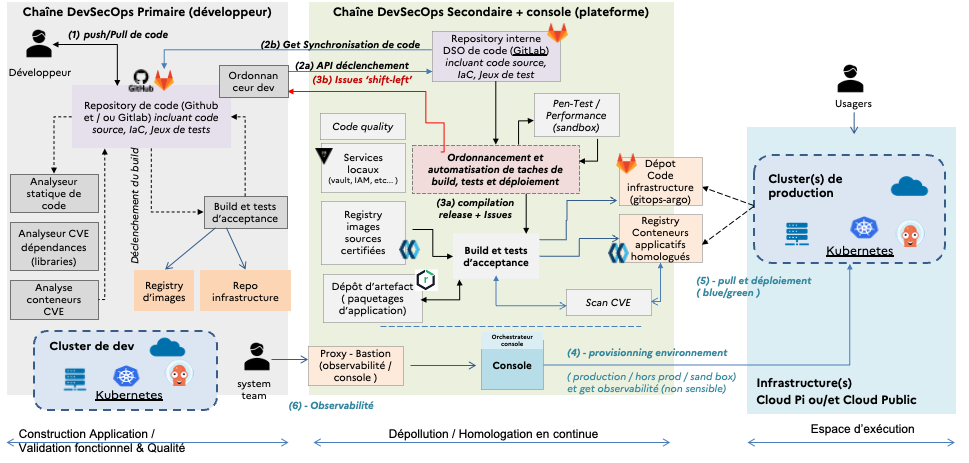
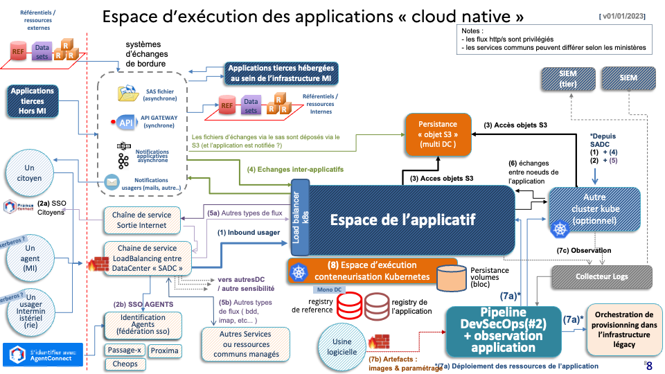
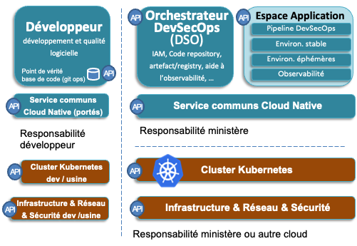

 

```
Cadre de Cohérence Technique (CCT)

Volet  : Cloud π Native  à portée interministérielle

Version : alpha.v4
Date : 27/03/2023
Auteur : Ministère de l’Intérieur
```

## TABLE DES MATIÈRES

<br>**1. Guide d’utilisation rapide**
<br>**2**. [**Le contexte, les enjeux, la vision**](#contexte-enjeux-vision)
<br>**3**. [**Principes généraux cadre Cloud Native**](#principes-generaux-cadre-cloud-native)
<br> - [Les configurations d’hébergement prises en compte](#configuration-hebergement)
<br> - [Gestion des non-conformités, dérogations et contribution](#gestion-non-conformite)
<br> - [Le modèle organisationnel, de responsabilité et de collaboration Cloud Native](#modele-organisationnel-responsabilite)
<br> - [Préconisations générales d’architecture et technique](#preconisations-architecture)
<br> - [Des spécificités à prendre en compte sur la création des conteneurs](#specificites-creation-conteneurs)
<br> - [Des spécificités à prendre en compte sur la topologie réseau et les ouvertures de flux](#specificites-flux)
<br> - [Des spécificités à prendre en compte autour de la qualité et de la sécurité des applications](#specificites-qualite-securite)
<br> - [Modèle d’intégration d’une application dans le cadre Cloud Native](#modele-integration-cloud-native)
<br>**4**. [**Présentation de l’offre inter-ministèrielle Cloud Pi Native et de ses évolutions pressenties**](#presentation-de-loffre-interministerielle-cloud-pi-native)
<br> - [Les magasins de composants kubernetes et d’image de base](#magasins-composants)
<br>**5**. [**Référentiel d’exigences et modalités d'usage**](#referentiel-exigences)
<br>**6**. [**Annexes**](#Annexes)
<br> - [Les normes industrielles, institutionnelles applicables](#normes-industrielles)
<br> - Liens vers autres contenus utiles(informatif)
<br> - [Glossaire](cct-glossaire.md)

## <a name="contexte-enjeux-vision">**2**- Le contexte, les enjeux, la vision</a>

**Audience : ce paragraphe s’adresse à tout acteur considérant l’usage de l’offre Cloud Pi Native du ministère de l’intérieur, il présente les principes fondateurs. Le cloud : des nouvelles possibilités techniques, une collaboration étendue des acteurs pour répondre aux enjeux d’un contexte exigeant, incertain et accéléré.**


À travers sa doctrine « Cloud au centre », l’État encourage l’ensemble des acteurs publics à se saisir de son potentiel afin de développer une nouvelle génération de services numériques de qualité et qui répond au besoin dans un cadre de normes juridiques adapté à l’usage. Cela répond notamment au besoin accru d’agilité et d’efficience de l’administration.

Le Cloud est une approche d’accès à l’infrastructure d’hébergement à travers une interface standardisée et rendant abstraite et normalisée les technologies sous-jacentes. Cette abstraction permet une automatisation poussée, supprimer les frictions organisationnelles, les non-qualités et lenteurs induites par des opérations manuelles. L’infrastructure est pilotable par du logiciel et donc automatisable avec des processus reproductibles.

La technologie Cloud Native fait référence à l’usage de Kubernetes. Kubernetes est une technologie issue des travaux des grands acteurs de l’Internet il y a plus de 15 ans pour rendre encore plus efficace et sécurisée l’usage des infrastructures techniques, la résilience des hébergements et apporter une souplesse organisationnelle accrue. Les grands services de l’internet s'appuient sur cette technologie, elle permettent une résilience extrême et permet d’absorber un trafic extrêmement important. 

Les architectures des applications se simplifient avec une abstraction de plus en plus grande de l’infrastructure avec notamment la montée en puissance de services managés, fonctions-as-a-service dans l’objectif recherché de diminuer la quantité de code produite et l’objectif est de réduire charge des équipes intégrées de développement, déchargé de nombreuse problématique de gestion de l’’infrastructure de leur application.

L’ensemble des organisations ayant mis en œuvre cette technologie telle que EDF, Orange, des services de vente en ligne, des Banques, Airbus, Urssaf, etc… ont vu également leurs efficiences de l’usage du numérique augmenter, il y a un _avant et un après_.

Le ministère de l’intérieur, l’un des premiers acteurs étatiques à avoir proposé une offre Cloud il y a plus de 5 ans, étend son offre de service, en proposant l’offre Cloud Pi Native combinant une offre d'hébergement kubernetes sécurisée jusqu’au niveau DR. Cette offre est accompagnée d’un modèle DevSecOps outillé permettant une fluidité organisationnelle accrue et un renforcement de la qualité des solutions numériques.

Les approches cloud, devops et l’agilité ont progressivement permis de concilier des postures antagonistes : les développeurs ayant besoin de pouvoir déployer fréquemment, et l’exploitation ayant au contraire besoin de stabilité et de diminuer les risques liés au changement. La clé réside dans une collaboration étendue de tous les acteurs en prenant compte de la sécurité à toutes les étapes : le devops.

**Une évolution des pratiques pour un numérique efficient et éco-responsable et réactif**

Les contraintes s’accentuent sur la production de services numériques, le standard de qualité général a augmenté massivement avec les acteurs du net et industrielle qui produisent des solutions ergonomiques, sécurisées qui montent à l’échelle facilement. Un fossé important s’est creusé entre l’efficience du numérique ‘legacy’ et ce monde moderne. 

L’environnement change rapidement, il devient incertain, il faut réagir de plus en plus rapidement, la pression augmente sur la production de solutions numériques ergonomique, nécessitant des cycles raccourcis, la prise en compte de l’éco responsabilité, de l’accessibilité et le maintien d’un haut standard de qualité et de sécurisation. 

Seul un changement majeur de pratiques s’appuyant sur l’opportunité du Cloud Native ( kubernetes ) et du DevSecOps permettent de satisfaire ce nouveau standard d’exigences.

Le mode produit et l’agilité sont indispensables en complément de l’utilisation du cloud, extrait de la doctrine cloud au centre:

“ _L’adoption du cloud doit s’accompagner de celle des pratiques associées à l’excellence dans la production de services numériques (proximité entre métiers et équipes informatiques, scalabilité, agilité, « devops », « continuous delivery » qui sont les garants de l’adaptation des produits à leurs utilisateurs) ;  “_

**Les principales caractéristiques du modèle opérationnel Cloud Native:**

Le fonctionnement évolue vers la suppression de la fragmentation des responsabilités dans la chaîne de production et l’automatisation de celui-ci. (cf mode2 proposé par le Gartner) 

**L’équipe projet intégrée (équipe produit) voit ses prérogatives étendues:**

* Elle est organisée autour du produit numérique livré. Elle fonctionne en modalité intégrée et de manière autonome en lien avec la vision et les contraintes fixées. 
* Elle est composée de développeurs, architectes, ergonome (ux-design), juriste, gestionnaire du changement, etc… orchestrée par le product owner et généralement facilité par un coach / scrum master agile. Elle est focalisée sur l'ergonomie, la qualité et la performance de la solution mise à disposition des usagers. C’est le modèle «You build it, you run it, you support it ». (vous l’avez construit vous l’opérez )
* Une équipe d’aide appelée “service team” qui peut être temporaire ou permanente selon la taille de produit est chargée de mettre en place l’automatisation et les environnements de travail et de production. Cette dernière doit être aguerrie à ces technologies et l’offre cloud native.

**L’hébergeur assure quant à lui**, la mise à disposition d’une offre de service hautement disponible et sécurisée. L’usage de l’offre est réalisé via une console, une interface technique normée (API), une documentation et des exemples accélèrent la prise en main.

Il assure également la fourniture de services d’abstraction tels que des services managés ou fonctions as a service, un pipeline devsecops etc…

**L’équipe intégrée est autonome et travaille sans échange avec l’hébergeur**.

La console mise à disposition assure ce lien avec une documentation associée. L’ensemble des opérations réalisées manuellement auparavant lors des étapes d’élaboration sont complètement automatisées. Le code logiciel est testé en permanence et automatiquement par un outillage : l’orchestrateur DevSecOps. 

Pour assurer la qualité du code, plusieurs principes sont mis en œuvre, une couverture de test (100% sur le back-end), l’analyse statique du code, l’analyse récursive de vulnérabilité des composants importés (librairie, images ), des tests de sécurité et de performances, tests spécifiques liés à des besoins de vérifications particulières.

L’équipe de développement est prévenue au plus tôt par l’orchestrateur DevSecOps en cas de non-qualité. L’orchestrateur offre des options techniques pour intégrer les retours dans le flux de travail du développeur afin de procéder à la correction au plus tôt des anomalies, cette modalité s’appelle “shift-left”. Infine, seul un logiciel ayant atteint le niveau de qualité fixé peut être déployé.  

Les développeurs assurent continuellement la qualité et la sécurité du code produit, la non-régression et l'absence de vulnérabilité soutenus par l’outillage mis en place, la chaîne devsecops, les environnement de codage (IDE) et gestionnaire de code deviennent de plus en plus en plus performant et identifient dès l’écriture ou l’intégration du code les erreurs d’algorithmies ou si un secret est laissé dans le code. 

Les architectures sont modulaires et les composants internes ainsi que les interfaces entre applications sont découplées, c’est à dire rendus indépendants techniquement et organisationnellement via des interfaces normées (APi). Cela permet la maintenance et les  évolutions indépendantes entre composants. Ce découplage contribue fortement à réduire le coût des changements et faciliter les transitions technologiques en cas d’obsolescence.

La conception de l’architecture, le choix des langages sont faits pour une efficience de l’usage des ressources d’infrastructures et également sur l’impact sur le poste de travail.

La conteneurisation, l'élasticité dynamique de la solution d'orchestration de conteneurs kubernetes, la mutualisation des infrastructures physiques soutiennent fortement cette  efficience. Le non-respect de ce principe de modularité a été identifié par la direction interministérielle du numérique comme l’une des causes d’échec des grands programmes de l’État. La modularité, l’indépendance technique et organisationnelle des modules lors du déploiement, permettent de réduire la taille des déploiements ce qui contribue à réduire les risques et fluidifier les mises en production. Les déploiements peuvent ainsi être rendus transparents pour  des usagers et les retours arrière éventuels sont  facilités. Il est ainsi possible de déployer en confiance, plusieurs évolutions par jour si nécessaire.

L’automatisation permet de  mieux contrôler et rendre les actions prédictibles, faciliter la reprise en cas d’incident et minimiser les coûts de maintien en conditions opérationnelles et de sécurité des applications. Plus aucune intervention manuelle n’est effectuée sur les environnements ce qui permet de réduire la variance, les non-qualités, et aussi de (re)construire très rapidement des plateformes.

In fine, la conception doit s’inscrire dans une démarche d’éco-conception et de sobriété numérique des conceptions (green IT)  permettant un usage plus efficient des ressources  qu’elles soient RH, financières. L’État devant être exemplaire. cf guide d’éco-conception.

## <a name="principes-generaux-cadre-cloud-native"> 3 - Principes généraux cadre Cloud Native</a>

Audience : ce paragraphe s’adresse à la communauté des concepteurs et architectes solutions, le lecteur est réputé compétent et formé sur les sujets abordés .

Le cadre de cohérence technique régule et normalise les différents domaines associés à l’élaboration et au maintien des ressources partagées nécessaires à la mise à disposition de solutions numériques de qualité répondant au besoin. Il s’assure que l’ensemble peut-être mis en œuvre de manière cohérente avec une consommation minimisée des ressources : financière, RH et écologique. Il recommande ou fixe les mesures permettant d’atteindre l’objectif, tout en favorisant l’innovation, la prise en compte de l’obsolescence régulière des technologies et la manœuvre RH nécessaire (formation continue, recrutement …)

Le volet Cloud Native du ministère de l’intérieur, hérite de normes industrielles, interMinistérielles, européennes. La portée est interMinistérielle, ce document a fait l’objet d’échanges avec la direction interMinistérielle du numérique et des ministères primo-accédants.

Pour le ministère de l'intérieur, il encadre la conception et l’hébergement d’applications qu’elles soient hébergées dans les datacenters du ministère ou bien à l’externe sur des clouds public. Ce volet s’applique notamment lors de la conception d’une nouvelle application ou une évolution significative d’une application existante. (cf Doctrine Cloud au centre)

Pour les autres entités étatiques, ce volet sert de présentation de bonnes pratiques et présente les conditions générales d’utilisation de l’offre Cloud Pi Native.

Ce document ainsi que le référentiel d’exigences sont annexés aux dossiers de consultation des entreprises. La portée administrative étant précisée par le règlement de consultation (RC) du marché lui-même, typiquement le RC et le Cadre des clauses administratives particulières (CCAP) peuvent exclure administrativement un candidat en cas de non-respect des exigences P primordiale. (hors dérogation soumise, instruite et accordée).

D’autres référentiels d’exigences ou des guides peuvent être applicables ou conseillés. voir plus loin le chapitre sur les cadres de normes supérieures.

**Offre de service Cloud (π) Native :**

Concerne la description de l’offre de service managé d’infrastructure Cloud **π** et d’une chaîne DevSecOps assurant l’homologation en continu et le déploiement en production. Cf. présentation de l’offre plus loin dans ce document.

**Poste de travail agent :**

Dans le cadre d’une application rendue accessible sur le poste de travail de l’agent, le lecteur est invité à se conformer également au volet _Environnement Numérique de Travail_, notamment sur les aspects d’intégration au SSO et la politique des navigateurs.

**Ouverture des données :**

Sur la thématique de l’ouverture et de la circulation de la donnée, le projet est invité à se mettre en conformité avec le volet idoine. Cela concerne notamment le référencement des objets métiers dans le référentiel de cartographie des données et la mise à disposition d’une facilité technique d’accès à la donnée basée sur un standard d’échange de type API.

L’ensemble des acteurs de l’État est invité à faire circuler la donnée au profit d’une simplification du fonctionnement des administrations et d’un service public ergonomique et proactif .  (cf rapport Bothorel, lois CRPA et 3DS, … )


### <a name="configuration-hebergement">Les configurations d’hébergement prises en compte</a>

Le ministère de l’intérieur dispose de plusieurs capacité d’hébergement d’application. Ces offres peuvent être historiques et liées à une entité  (ex: Sgami, ANTS)  ou centrales.

Les offres centrales sont découpées en plusieurs catégories  :

* **Physique ou virtualisées** généralement de type VMWAre tel qu’Isocèle ( DNUM), STIG (STSI2). Cette offre est accessible qu’au MIOM et seul l’exploitant gère la plateforme et les actes d’intervention techniques via Ticketing ITMS
* **Offre Cloud Pi "legacy"** : offre Iaas basée sur OpenSack, actuellement en bascule vers Gen2. La gestion interne des ‘tenants’ est à la main du développeur, le reste via ticketing. Le développeur gère son outillage en autonomie


* **Offre Cloud Pi Native** ( objet de ce volet de CCT ) :  nouvelle offre associant une homologation continue, un socle d’homologation et un hébergement étatique sur kubernetes avec une ouverture ‘accéléré’ des flux réseau.

Les configurations suivantes sont prises en compte par ce volet Cloud (Pi) Native du CCT.
* Hébergement sur les clusters kubernetes managés par le ministère de l’Intérieur, jusqu’au niveau « donnée restreinte » ;
* Hébergement sur un cluster kubernetes externe au ministère, compatible avec la sensibilité des données manipulées ;
* Hébergement sur un cluster kubernetes dédié et géré par l’application;
* Une approche hybride multi-clusters ( plusieurs environnements de production "on-premise" et/ou sur cloud public ).

Pour l’ensemble de ces configurations l’usage de la chaîne DevSecOps managée par le Ministère de l’Intérieur est impératif. (hors cadre dérogatoire accordée) 

### <a name="gestion-non-conformite">Gestion des non-conformités, dérogations et contribution</a>

L’évolution rapide des technologies cloud peut conduire à ce que le cadre CCT restreigne l’innovation. Il est également souhaité, pour éprouver le modèle, de notifier le département architecture d'entreprise du Ministère de l'intérieur au plus tôt des éventuelles impossibilités ou limitations remarquées. Les directions d’applications ou les organisations utilisatrices peuvent contribuer, via un échange préalable, à enrichir les fonctionnalités de l’offre ou du cadre lui-même. Sur l’offre la contribution est effectuée directement sur le repository open source de la solution via un pull request.

En cas de non-conformité au CCT ou absence de contribution à l’offre, une demande de dérogation dûment motivée sera formulée à l’avance par la direction d’application. Seule la notification de la décision permet d’amender le besoin de conformité au cadre, temporairement ou de manière pérenne dans le cadre d’une dérogation. Dans le cadre d’une dérogation, la direction d’application prend à sa charge le surcoût complet de possession. ( formation, homologation, personnel assurant la tme, etc… )

Lors de l’utilisation du cadre et de l’offre Cloud PI Native, toute organisation souhaitant décliner ce cadre dans un document de norme inférieur pour un besoin propre est invitée à référencer la dernière version de ce document en l’état.  Dans la hiérarchie des normes, une instruction de niveau inférieur ne peut entrer en conflit ou contredire ce présent document.

### <a name="modele-organisationnel-responsabilite"> Le modèle organisationnel, de responsabilité et de collaboration Cloud Native</a>

L’architecture, le modèle de responsabilité et d’organisation à mettre en place est orienté pour maximiser la qualité, la sécurité, la fluidité opérationnelle et l’évolutivité du produit en  tirant parti au maximum des possibilités offertes par la technologie kubernetes, un flux de production DevSecOps et une collaboration étendue entre les acteurs.

**L’élargissement de la responsabilité du développeur**

La responsabilité du développeur est élargie dans le cadre Cloud Native. Il élabore et exploite une solution qui répond au besoin métier généralement une automatisation d’un ou plusieurs processus métiers . Le développeur s'assure de la qualité et de la disponibilité du service rendu à l’usager selon le précepte : « You build it, you run it ». Il s’organise en équipe intégrée, si nécessaire avec de l’externalisation.

Le développeur met à disposition d’un point de vérité du code sous la forme d’un ou plusieurs dépôts de code logiciel fonctionnel et d’infrastructure. Il met en place un flux intégré et continu de production en s'appuyant sur un orchestrateur primaire DevSecOps qu’il construit et opère. 

Le développeur initialise et supervise le pipeline de l’orchestrateur secondaire opéré par le ministère de l’Intérieur (cf plus loin sur la configuration de l’offre Cloud Pi Native). Il intègre les étapes de vérification de sécurité génériques imposées par le minist!re et spécifiques issus de la démarche d’homologation. 

L’ensemble combiné des orchestrateurs primaire et secondaire assure la fonction d’homologation et de déploiement en continu du produit numérique. 

Dans le cas de la détection d’une non-qualité, la progression du déploiement est stoppée par la/les chaînes, le développeur est prévenu en temps réel et doit corriger au plus tôt les défauts remontés. Cette approche permet de garantir un niveau de qualité, évite des régressions et maintient la dette technique au niveau le plus bas.

Sur le plan organisationnel le développeur met généralement en place :
* l’agilité avec des itérations courtes de constructions et de vérification des usagers ;
* le découpage des livraisons en lot de taille de réduite ;
* la mise en place d’une culture de collaboration étendue et des pratiques intégrant la sécurité à toutes les étapes.

**La répartition des responsabilités s'établit de la manière suivante :**

**L'équipe produit intégrée :**

* est responsable de l’application, de la qualité du code  et du bon fonctionnement de l’application pendant <span style="text-decoration:underline;">l’ensemble du cycle de vie de l’application. </span>
* est responsable de définir et d’ajuster l’infrastructure et l’élasticité du dimensionnement, nécessaire à son application (sur la base de l’offre Cloud adaptée selon la sensibilité des données) Il s'appuie sur les patterns applicatives mise à disposition, les magasins de charts helms et des _operators _disponibles. Il est déconseillé, par exemple, de repackager une base de données alors qu’un _operator_ ou un chart est disponible. ( simplification et systématisation du mcs )
* fourni un code de qualité exempt de défaut d'algorithmes, de qualité et de vulnérabilité ;
* met en œuvre le flux de production, logiciel local permettant d’assurer la production et la démonstration d’un code de qualité exempt d’anomalie fonctionnelle, de non-qualité et de vulnérabilité, notamment dans les librairies importées ;
* Il pose les normes de développement des langages utilisés ;
* Il met en place des pratiques DevSecOps visant un maintien de la qualité dans le temps avec les composantes suivantes ( cf outillage DevSecOps) :
    * test driven development ;
    * une couverture de test unitaire à 100% du back-end ;
    * une couverture significative des tests du front de l’application ;
    * analyse statique de qualité du code ;
    * analyse récursive des vulnérabilités des librairies importées ;
    * utilisation exclusivement d’images sources maintenues en condition de sécurité et certifiées (distribution LTS) ;
    * la conception des tests d’intégration en sandbox ;
    * la fourniture des outils nécessaires à la remontée de l'état de santé des briques applicatives destinées à fonctionner en production (healthcheck) ;
    * la fourniture des indicateurs nécessaires au suivi en temps réel de la qualité en condition opérationnelle de sa solution (exports prometheus) ;
    * l'exploitation des logs remontés.
* Il met en place un hébergement sur une plateforme kubernetes afin d’assurer la démonstration du bon fonctionnement de l’application avec la solution qu’il préfère soit internalisée (avec un moyen de mener des démonstrations) ou sur cloud public. 
* Il met en œuvre l’intégration technique et organisationnelle avec la chaîne DevSecOps de l’offre Cloud Pi Native et initialise le flux logiciel  global (cf plus bas). 
* Il maintient un point de vérité du code logiciel ainsi que celui du code d’infrastructure. Celui-ci est accédé par la chaîne DevSecOps étatique, la sécurisation d’accès issus par token.
* Il est responsable de la surveillance de l’ensemble des pipelines, y compris pour celui géré côté ministère. 
* Il met en place une intégration du flux de retour d’anomalie “shift-left” des orchestrateurs afin de permettre une correction au plus tôt des anomalies.
* Il effectue l’apprentissage comportemental du firewall applicatif Web (WAF) vis-à-vis de l’application dans le cadre fixé par le ministère.
* Il est invité à mettre en œuvre ce pipeline au plus tôt dans le processus de réalisation.

**Notes :**  ( cf exigences CCT  )

**L’équipe de développement respecte les règles suivantes permettant une qualité de code en progression et un maintien de la sécurité :**

- minimise la portion spécifique de code développés en s’appuyant sur le catalogue des services proposés. (revoir régulièrement)
- met en place une couverture de test unitaire complète du back-end  ( et fourni les moyens de vérification automatisé à la chaîne secondaire )
- mener une analyse de code systématique le plus tôt possible ( les langage et IDE modernes fournissent des fonctions de ce type )
- mener une analyse de CVE des dépendants importées 

L’équipe projet met en oeuvre une activité continue de refactoring du code produit. La qualité du code ne peut être décroissante.

**Elle fournit les preuves** que des tests de sécurité, de qualité, de robustesse des algorithmes ont été mis en œuvre, et qu'ils n'ont pas remonté de vulnérabilités ou d'erreurs majeures. En s’appuyant notamment sur les logs des analyses des outils de la chaîne primaire. Elle fournit la preuve (ex: le document) des normes de développement et pratiques permettant de maîtriser la qualité du code produit. ( refactoring, peer review, etc.. )
 

**L’exploitant ministériel de l’orchestrateur DevSecOps** :

Il assure la gouvernance et la cohérence structurelle de l'ensemble des régions de cloud PI. Il associe à ce titre dans ses décisions des représentants de l'ensemble des opérateurs cloud.

* Il s'assure de la disponibilité et de la qualité de fonctionnement de la chaîne DevSecOps et maintient à jour la documentation sur le fonctionnement des interfaces et assure les évolutions fonctionnelles;
* Il assure les retours d'anomalies "shift-left" lors des opérations de déploiement continu. L'intégration et leurs traitements sont à la charge du Concepteur / développeur;
* Il contribue à la mise en place et l’évolution du catalogue d’operator Kubernetes, de charts helm et du référentiel de pattern de référence;
* Il est également en lien avec les autorités d’homologation afin de s’assurer que l’ensemble est en condition d’assurer la protection d’ensemble;
* Il intègre les propositions d'évolution “pull request” proposée en fonction de son plan de charge et d’une négociation préalable;
* Il oriente le concepteur / développeur vers l'opérateur cloud qui hébergera son produit;
* Il sera en charge de migrer les applications hébergées vers un autre opérateur si nécessaire;
* Il fournit la documentation dont les éléments d’orientation ou d’aide à la migration permettant au développeur de s’orienter vers l'opérateur cloud qui hébergera son produit; ( cela dépend également des décisions projets ou d’homologation )

**L’opérateur Cloud** :

ll assure le maintien en condition de disponibilité et de sécurité de l’offre d’hébergement, l’interface API de management, la console,  la gestion capacité et les offres de services managées.
Le Cloud PI est constitué de plusieurs régions ( elle même constituées de plusieurs centres de calculs ), zones de sensibilité usuel et DR.
Chacune des régions peuvent faire l’objet d’une affinité ou restriction de service sur la nature des données, des typologies de projets, ministériels et interministériel. Ces affinités ou restrictions sont également applicables à la chaîne De SecOps secondaire.
La gouvernance du produit ‘Cloud Pi Native” à portée interministérielle et ministérielle définit la politique d’ensemble, elle traite d’aspects tel que :
- restriction ou affinité d’accès aux régions, projets, chaine secondaire;
- politique de données définie dans l'extension de la définition de "données restreintes" ;
- la capacité en matière de ressources nécessaires à héberger de nouveaux projets ;
- la localisation géographique et le nombre de centres de calculs constituant sa région ;
- les services mis à disposition ;
- les possibilités d'interconnexion réseau avec d'autres systèmes;

La version courante de l’offre et la politique d’usage est mise à disposition sur portail et notamment vers l’utilisateur lors de la connexion à la console. La version courante est présentée dans les grandes lignes au paragraphe 4.

Des pratiques complémentaires sont introduites dans la configuration Cloud Native :

**Le GitOps**, contraction de git et opération, est indispensable à la gestion des applications Cloud Native avec Kubernetes. Ce mode d’organisation du code d'infrastructure permet de maîtriser la description de l’infrastructure de production avec les mêmes pratiques de revue collaborative que celle du logiciel. Il est par exemple strictement interdit de faire des modifications « à la main » sur l’environnement de production, toute variation étant automatiquement supprimée. L’infrastructure réelle est strictement celle décrite par les fichiers d’infrastructure.

**Le “shift-left”** (vers la gauche, du processus) fait référence à la remontée le plus tôt possible vers le développeur des anomalies identifiées par la chaîne de déploiement et de vérification DevSecOps. Ce flux est notamment mis en œuvre depuis la chaîne secondaire.

**<span style="text-decoration:underline;">Présentation du cycle d’usage de l’offre pour les directions d’applications:</span>**

**Phase d’initialisation du projet**

* Le développeur initialise l’environnement de développement, il est autonome pour les choix techniques, il respecte les exigences organisationnels et de processus automatisé permettant de maintenir une qualité constante.
* Le développeur décide de l’infrastructure d’hébergement en fonction des contraintes sur les données et la liste des options autorisées et maintenue par la Dinum et l’ANSSI en lien avec la doctrine Cloud au centre, notamment  :  Cloud Pi, cloud externe de confiance ou plateforme dédiée (si besoin spécifique) 
* Le développeur commande, (signature de convention), initialise l’espace projet au ministère et configure selon son choix d’infrastructure les environnements désirés. Il récupère les clés techniques nécessaires à l’intégration des pipelines.
* Le développeur effectue l’intégration des pipelines, cf  labels (2) , et (4) si l’infrastructure est externe.
* Il vérifie que l’ensemble du pipeline est opérationnel à partir d’un code d’exemple fourni de type “hello word”.

**Principe de fonctionnement du pipeline d’ensemble (chaines primaire et secondaire)**



* **[1]** Le code logiciel ainsi que celui de description des infrastructures sont produits au sein de l’espace du développeur/concepteur, généralement en externe au Ministère de l’Intérieur.
* **[2a]** **[2b]**Une interface bi-directionelle entre l’espace du concepteur / développeur et celui de DSO permet en push-pull à la chaîne secondaire de récupérer automatiquement l’ensemble du code et des dépendances nécessaires.
* Le développeur déclenche par appel API les services de synchro /  build / deploy. ( il n’y accède pas directement sauf via un Bastion)
* **[3a][3b]** La chaîne d’orchestration DevSecOps effectue la récupération du code, des tests de qualité du code, scan de vulnérabilité des dépendances, la reconstruction, les tests de nos régressions, des tests d’homologation, vérification des manifests / charts etc… au regard des politiques de sécurité et dépose les images certifiées sur la registry de la chaîne ainsi que le code d’infrastructure.
* Le concepteur/développeur accède à un retour d’information détaillée sur le succès ou sur les éventuels défauts, lors du build, deploy de l’application par DSO. ( via message ou webhook )
* **[4]** : La console provisionne si nécessaires les environnements en ‘poussant’ les ressources nécessaires une foi (secrets, application.yaml (argo), certificats, etc... )
* **[5]** : L’infrastructure vérifie régulièrement les changements sur le dépôt d’infrastructure (ou déclenchement forcé par API) et synchronise l’environnement à la cible visé et opère une bascule blue-green transparente, cf ArgoCD  ( si échec l’environnement de prod reste inchangé )
* **[6]** : Le développeur accède à un proxy d’observation du fonctionnement de l’application
* Note : Les développeurs n'accèdent pas directement à la production. Seuls les administrateurs habilités peuvent y avoir accès via bastion.


### <a name="preconisations-architecture">Préconisations générales d’architecture et technique</a>

Ce chapitre précise les aspects importants liés à l’usage de kubernetes dans le cadre du ministère de l’intérieur. Il est attendu que les acteurs soient correctement formés à la solution kubernetes et se maintiennent à jour. La technologie évoluant rapidement. 	

Le fondement des normes techniques est issu du cadre “Cloud Native”, largement accepté et appliqué au sein de l'État et du secteur privé, tel que les “15 factors”.

C’est le respect de ces normes qui permet à la fois d’adresser les enjeux de performance en termes de vitesse de livraison et de qualité de service, mais aussi de normaliser les applicatifs pour une meilleure évolutivité et maîtrise de la dette technique. Enfin, elles assurent une intégration fluide au sein des systèmes d’information ministériels.

Un des principes cœurs est de laisser un certain degré de liberté au concepteur/développeur sur le fonctionnement interne de son application. Au contraire, les intéractions avec les autres applications et services seront particulièrement contraintes.

Il est à noter que la plateforme d’orchestration de conteneurs Kubernetes est la seule s'inscrivant dans le présent cadre de cohérence, celle-ci étant considérée comme l’état de l’art, et open-source de surcroît.

À propos de la solution mutualisée d’hébergement Cloud π Native

La solution d’hébergement est basée sur des clusters Kubernetes implémentés et opérés par chaque opérateur cloud de manière à ce que les versions de base ainsi que les configurations techniques et organisationnelles s’appuient sur les recommandations de sécurisation de l’ensemble des acteurs cybers.

Les développeurs n’accèdent pas directement à la plateforme ; cet accès s’effectue via une console dédiée et un flux “gitops” (via l’usage d’ArgoCD).

Pour information : des tests de compatibilité avec d’autres solutions d’hébergement d’acteurs du cloud public ont été menés avec succès.


### <a name="specificites-creation-conteneurs">Des spécificités à prendre en compte sur la création des conteneurs</a>

Kubernetes impose une rigueur un peu plus élevée à l’initialisation que d’autres solutions.

Les pods (conteneurs) sont **obligatoirement rootless**, c’est à dire que le compte root n’est jamais utilisé pour faire fonctionner le service et ils utilisent uniquement des ports > 1024.

**Note :** Toute implémentation Kubernetes proposée par un opérateur cloud PI doit interdire le lancement de pod utilisant le compte root. Ce point n’est pas modifiable. Ceci est un point d’attention majeur, la quasi-totalité des conteneurs à disposition sur les plateformes de partage de conteneurs n'étant pas rootless.

Les pods doivent démarrer dans leur configuration cible sans état, ou via le passage de paramètres de démarrage ou d’environnement.

Les pods doivent démarrer rapidement afin de permettre au mécanisme d’orchestration de fonctionner sans délai.

Les pods sont responsables de vérifier au lancement, si l’application est dans la condition initiale de premier lancement, ou bien s’il faut initialiser ou modifier d’autres ressources telles qu’une base de données.

L’architecture de l’application, hors persistance de données, est conçue pour être complètement stateless, c'est-à-dire, sans aucune persistance de sessions, états et liens, les pods peuvent être basculés à la volée d’un nœud à un autre sans préavis.


### <a name="specificites-flux">Des spécificités à prendre en compte sur la topologie réseau et les ouvertures de flux</a>

L’organisation de réseau est segmenté par type de service porté par le flux. L’organisation de réseau est segmenté par type de service porté par le flux. ( flux usagers, interdatacenters, interapplicatifs )
L'ouverture automatique des segments réseau est propre à chaque opérateur cloud. L'ouverture manuelle de ces segments doit répondre à la politique de l'opérateur et être exécutée ou rejetée sous garantie d'un délai maximum (5 jours par exemple).

### <a name="specificites-qualite-securite"> Des spécificités à prendre en compte autour de la qualité et de la sécurité des applications</a>

L’objectif d’ensemble est de s’assurer que le code produit est de qualité constante ou accrue, exempt de vulnérabilités algorithmiques ou importées néfastes.

Pour atteindre ces objectifs plusieurs mécanismes doivent être mis en place par l’équipe de développement intégrée :

- minimiser la portion spécifique de code développés en s’appuyant sur le catalogue de service proposé.
- mettre en place une couverture de test unitaire complète du back-end  ( et fournir les moyens de vérification automatisé à la chaîne secondaire )
- mener une analyse de code systématique le plus tôt possible ( les langage et IDE modernes fournissent des fonctions de ce type )
- mener une analyse de CVE des dépendants importées 

La chaîne secondaire reconstruit les images à partir des codes sources et procède aux mêmes tests avec des outils complémentaires. L’orchestration du pipeline secondaire est gérée par l’équipe et intègre les tests de vérification issue de la démarche d’homologation de l’application qui fixe les seuils de blocage de déploiement.

Les tests typiques consistent à vérifier la qualité du code ( et la bonne couverture des tests ), et le bon fonctionnement de l’application (non regression) et le scan de vulnérabilité.

L’équipe de développement reçoit via l’interface “shift left” une notification des rapports qui doit être intégrés au flux de travail pour correction.

**La chaîne secondaire bloque les déploiements si la qualité d’ensemble du code est en baisse ou si l’ensemble porte des vulnérabilités critiques.**

**L’équipe projet est invitée à mener une activité constante de refactoring du code produit.**

### <a name="modele-integration-cloud-native"> Modèle d’intégration d’une application dans le cadre Cloud Native </a>

Le schéma ci-dessous précise le cadre général d’intégration d’une application. Des variantes sont possibles entre les ministères, elles sont précisées directement auprès des équipes concernées. Le respect de cadre permet à la direction d’application d’accéder à un socle de sécurité accélérant les homologations, l’ouverture automatique des segments réseau et l’homologation en continu.

**Vision logique d’ensemble et services de socles**


**Architecture d’intégration réseau et flux typiques**  



Le schéma (indicatifs) précise l’architecture d’intégration d’une application est les types de flux:

* (1) Inbound usager : accès à l’application des usagers https / websockets (depuis RIE ou Internet )
* (2a) SSO Citoyens + (2b) SSO AGENT : authentification des usagers ( OIDC / SAML V2 )
* (3) Acces objets S3 : accès à la persistance objets de l’application
* (4) Echanges inter-applicatifs ( bordure externe de l’application) : permet d’échange entre des applications de porteurs différentes, selon plusieurs modalités possibles : API restful synchrone,  Asynchrone , fichiers
* (5a) Autres types de flux : autres types d’échange, sortie vers internet, vers d’autres zone d’hébergement, ou entre des zones de sensibilité différentes
* (5b) Flux d’accès à des services communs ou ressources  communes ( de protocoles plus variés)
* (6) échanges entre noeuds de l’application : permet la réplication de l’application entre 2 data centers au même niveau sensibilité de données
* (7a) Déploiement des ressources de l’application : gestionnaire & console DEVSECOPS / le pipeline interagit avec le/les clusters kubernetes et les gestionnaires d’infrastructures utilisés ( ouverture de flux réseaux, etc... )
* (7b) Artefacts images & paramétrage : ensemble des ressources liées à une application ou communes ( ex : sources d’images de référence )
* (7c) Observation : permet de collecter les données liées à l’usage pour la mise au point de l’application ou données de vie.
* (8) Kubernetes, sous la forme d’un ou plusieurs namespace(s) isolés ou couplés : fournis l’espace d’exécution de l’application et la gestion des volumes pour le stockage bloc.


## <a name="presentation-de-loffre-interministerielle-cloud-pi-native"> 4- Présentation de l’offre inter-ministérielle Cloud Pi Native</a>

L’offre Cloud PI native répond aux exigences du CCT à travers un ensemble organisationnel et technique. Elle propose une offre Cloud régalienne, souveraineté, sécurisée et isolée de toute problématique juridique extra-européenne. 

La composition de l’offre est amenée à évoluer en termes de catalogue de service selon la demande et les financements disponibles, ces évolutions permettront la diminution de la quantité de code produit par les équipes de développement et l'accélération des performances, typiquement : fonctions as services, services managés, gpu;Les offres d’hébergement compatibles avec les applications « Cloud Native » du ministère de l’intérieur sont :
- Hébergement de l’application sur les infrastructures internes infogérées ;
- Hébergement de l’application sur des infrastructures cloud externes ;
- Hébergement de l’application sur des infrastructures gérées par l’application.L’ensemble de l’administration technique de la plateforme et des infrastructures est automatisée, pilotée par le développeur/concepteur via l’orchestration DevSecOps avec mise en œuvre d’un principe dit _gitops_: la plateforme de production “tire” le déploiement.Pour rappel, le développeur n’accède pas directement à l’environnement de production. Toute correction ou évolution suit le processus de déploiement automatisé passe via le principe “gitops” évoqué ci-dessus. Le développeur dispose d’un accès libre à ses environnements (via un poste bastion si l’environnement est situé côté ministériel) il dispose également d’un accès proxifié aux indicateurs de la production. La service team qui l’accompagne, avec les accréditations nécessaires, dispose quant à elle d’un poste dédié lui permettant d’accéder directement via un bastion aux services d’observabilité et faciliter le débogage en production. (note modalité en cours d’évaluation incrémentale )


Le modèle de responsabilité est présenté ci-dessous :



L’ensemble du code source de l’offre Cloud PI Native et sa documentation sont disponibles en open-source sous la licence MIT. Toute contribution est la bienvenue.


Note : chaque région est autonome dans son fonctionnement. Seul le service de stockage objet de type S3 est accessible sur l’ensemble des régions ministérielles. ( réplication en proximité dans le datacenter).

### <a name="magasins-composants">Les magasins de composants kubernetes et d’image de base</a>

Associée avec l’offre Cloud pi Native, des magasins de composants kubenetes sont mis à disposition incrémentalement selon les besoins des applications cela inclut celui de l’éditeur RedHat. Le développeur peut dès aujourd’hui s’appuyer sur un catalogue porté par l’Insee autour de son produit Onyxia : <https://github.com/InseeFrLab/helm-charts>

L’équipe produit est fortement invitée à l’utiliser ces composants courants et ne pas refabriquer une version dédiée dont le cycle ne sera pas en adéquation avec les besoins de réactivité en mcs.

A propos des images de base nues, il est recommandé d’utiliser les versions dites "LTS" , certifiées et maintenues selon un processus qualité au sein des communautés ou éditeurs pour la construction des pods/conteneurs. Debian, Redhat, Ubuntu font partie des communautés les plus attentives.

Sur les besoins "classiques" de persistance : postgres, redis, mariadb, mongodb, elastic, etc… l’approche recommandée de s’appuyer sur les opérateurs kubernetes disponibles et les objets statefullSet. 

Sur le cluster de production les operators sont déployés par l’hébergeur car généralement ils requièrent les droits globaux. L’équipe projet doit vérifier les versions disponibles lors de la conception de son projet.

## <a name="referentiel-exigences">5- Référentiel d’exigences et modalités d'usage</a>

Les exigences du CCT sont classées en 2 niveaux d’exigence (périmètre du Ministère de l’Intérieur) :

* **P - Primordial** : L’exigence est impérative et traitée administrativement.
* **I - Important**  : Exigence prise en compte pour la notation technique de la solution

Précisions sur le cas de l’exclusion administrative (périmètre du Ministère de l’Intérieur) :

* La non-conformité au cadre de norme entraîne l’exclusion administrative lors du dépouillement et la mise en œuvre des actions de remédiation du marché lors de l’exécution du marché.
* La non-conformité aux exigences d’architecture entraîne l’impossibilité d’utilisation du socle de sécurité associé à l’offre Cloud Native

Par défaut les règles du CCT s’imposent. Elles peuvent être précisées dans le cas d’un appel d'offres dans le règlement de consultation pour le dépouillement des offres et dans le CCAP pour l’exécution du marché. Une demande de dérogation est possible. ( cf paragraphe ad hoc )

Pour information les exigences sont organisées telles que décrites ci-dessous :


1. **Standards & Normes industrielles et étatiques :** ensemble des exigences relatives aux normes de niveau supérieur à respecter pour toute application étatique
2. **Code applicatif & Image :** exigences issues des “15 factors” pour garantir la conception d’une application “Cloud Native”, associées aux exigences minimales permettant de s’intégrer au contexte du Ministère de l’Intérieur
3. **Modèle d’opération :** _voir le chapitre précédent_
4. **Intéractions & Flux :** exigences d’intégration et d’intéraction inter-applicatives dans le contexte étatique et du Ministère de l’Intérieur
5. **Infrastructure :** exigences et prérequis concernant l’infrastructure sous-jacente (notamment Kubernetes)
6. **Services mutualisés Applicatifs et d'Infrastructure :** exigences d’intégration aux services centralisés du Ministère de l’Intérieur, permettant une homogénéisation de la production, un meilleur contrôle et une maîtrise de la dette technique

## <a name="Annexes">6- Annexes</a>

### <a name="normes-industrielles"> Les normes industrielles, institutionnelles applicables</a>

La conception de système d’information dans le cadre de l’État est encadrée par un ensemble de recommandations ou règles à mettre en œuvre.  Ces normes sont citées ci-dessous. Le lecteur est invité à vérifier qu’il dispose des versions les plus à jour.

|       | Liens |
|-------|--------|
|Norme industrielle|https://kubernetes.io/fr <br> ArgoCD (GitOps): https://argo-cd.readthedocs.io/en/stable/ |
|Guides & outils pour la conception| **Design System FR**. Le système de design de l’État ( qui intègre le RGAA ) : https://www.systeme-de-design.gouv.fr/ <br> **Guide d’éco conception** : https://ecoresponsable.numerique.gouv.fr/publications/referentiel-general-ecoconception |
|Divers guides de conceptions logiciels| https://guides.etalab.gouv.fr/accueil.html<br>https://catalogue.numerique.gouv.fr<br>https://schema.gouv.fr<br>https://code.gouv.fr<br>|
|Cadres de pratiques de conception et de conduite de projet agile|https://www.numerique.gouv.fr/actualites/guide-pour-allier-agilite-et-securite-numeriques/
|Logiciel libre| Socle inter-ministériel des Logiciels Libres ( SILL) de par sa fonction de source pour le référentiel de produits du CCT Ministériel : https://sill.etalab.gouv.fr/fr/software|
|Normes inter-ministérielles de conception de solutions|**Doctrine cloud de l’état** :https://www.legifrance.gouv.fr/circulaire/id/45205<br>**Référentiel Général d’Accessibilité pour les Administrations** :https://accessibilite.numerique.gouv.fr/|
|Référentiel Général de Sécurité, en association avec le règlement européen et l’EIDAS.|https://www.ssi.gouv.fr/entreprise/reglementation/confiance-numerique/le-reglement-eidas/|
|Référentiel Général de Gestion des Archives|https://francearchives.fr/fr/circulaire/R2GA_2013_10|


### Liens vers autres contenus utiles(informatif)

[https://kubernetes.io/fr/](https://kubernetes.io/fr/)

[https://www.rancher.com/products/k3s](https://www.rancher.com/products/k3s)

<span style="text-decoration:underline;">https://www.redhat.com/en/technologies/cloud-computing/openshift</span>

[https://argo-cd.readthedocs.io/en/stable/](https://argo-cd.readthedocs.io/en/stable/)

[https://www.redhat.com/en/topics/microservices/what-is-a-service-mesh](https://www.redhat.com/en/topics/microservices/what-is-a-service-mesh)

<span style="text-decoration:underline;">https://www.redhat.com/en/topics/devops/what-is-gitops</span>

[https://www.cloudcomputingpatterns.org/](https://www.cloudcomputingpatterns.org/)

[https://12factor.net/fr/](https://12factor.net/fr/)

[https://tanzu.vmware.com/content/blog/beyond-the-twelve-factor-app](https://tanzu.vmware.com/content/blog/beyond-the-twelve-factor-app)

[https://www.techworld-with-nana.com/devops-bootcamp](https://www.techworld-with-nana.com/devops-bootcamp)

[https://ecoresponsable.numerique.gouv.fr/publications/bonnes-pratiques/bonnes-pratiques/#bonnes-pratiques-services-numeriques](https://ecoresponsable.numerique.gouv.fr/publications/bonnes-pratiques/bonnes-pratiques/#bonnes-pratiques-services-numeriques)

La documentation sur le CloudPI (RIE) :[ https://pi.rie.interieur.gouv.fr/reseau-cas-dusage/](https://pi.rie.interieur.gouv.fr/reseau-cas-dusage/)

